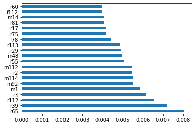

<center></center>

**ToDo**

- [ ] Exploratory Analysis
- [x] Most popular recommendation --> make a general recommendation to all users of the most popular products and use this as a benchmark performance
- [ ] Try on different subsets of clients!
- [x] Add F1 measure
- [ ] Add multi-label prediction without network features
- [ ] Limit translation in terms of number of words that appear in both spaces (i.e. only brands)

# Introduction


*Next Product To Buy (NPTB) problem*

I will start with the user-product network.
The N2VSCDNNR paper proposes to project this network in two unipartite networks. Unfortunately this would lead to separate vector spaces and make it impossible to compare user/merchant and item vectors.

Instead, keep the bipartite network. Apply simple DeepWalk and see what happens. Then try Node2Vec with other parameter settings (p,q)? And finally have a look at embedding methods which take heterogeneity into account (e.g. Bine and Metapath2Vec++)

references: [N2VSCDNNR: A Local Recommender System
Based on Node2vec and Rich Information Network](https://arxiv.org/pdf/1904.12605.pdf)


# Import of packages


```python
import os
import numpy as np
import pandas as pd
pd.set_option('display.max_columns', 500)
pd.set_option('display.max_rows', 500)
#import feather
import networkx as nx
import subprocess
#import xgboost as xgbS
import random

import logging
logging.basicConfig(format="%(levelname)s - %(asctime)s: %(message)s", datefmt= '%H:%M:%S', level=logging.INFO)
import gensim
from gensim.models import Word2Vec
from gensim.models.callbacks import CallbackAny2Vec

from IPython.display import display

import glob
from tqdm import tqdm
import datetime as dt

# Classifiers
from sklearn.multiclass import OneVsRestClassifier
from xgboost import XGBClassifier

# Evaluation metrics
from utils import recallatk, precisionatk, precision_recall_at_k, preprocessing_mapk, sort_probabilities
from sklearn.metrics import hamming_loss
from ml_metrics.average_precision import apk, mapk
from sklearn.metrics import f1_score

from utils import evaluate_classifier

%load_ext line_profiler
```


```python
# Node2Vec implementation with p and q parameter for biased random walks.
# See: https://github.com/eliorc/node2vec

from node2vec import Node2Vec
```

# Preprocessing

## Dask - reduce dataframe by sampling based on 'Dlvr_Pnt_No''


~~*Split dataset into two parts: first year, second year~~

~~* Find for every merchant whether they bought a product in year 2 which they never bought in year 1. Note down for every merchant which product this  was.~~


* Take a random sample of all 'Dlvr_Pnt_No'. Consider only transactions made by these subset of clients.
* Use dask to reduce dataset to a manageable size which only contains transactions made by the subset of clients.

import dask
import os
from distributed import Client, LocalCluster

from dask import dataframe as dd

# Macbook has hyperthreading, hence maximum number of threads = cores*2 = 6*2
os.environ["NUMEXPR_MAX_THREADS"] = "12"
# Create a local Dask cluster
cluster = LocalCluster()
# Create a client to interact with the local Dask cluster
client = Client(cluster)
client# Read the all_sales.csv file
df = dd.read_csv('./data/all_sales/*.csv', parse_dates=['Inv_Dt'])

#print(type(df))
#df.info(verbose=True)
#df.describe().compute()

# select only the interesting columns
df = df.loc[:, ['Dlvr_Pnt_No','PRD_NM','Inv_Dt', 'COST_OF_GOODS']]

# Make a random sample of customers (to see where this brings us) 
t = df.Dlvr_Pnt_No.drop_duplicates()
clients = t.compute()
unique_clients = set(clients)
print(len(unique_clients))
# Select 10,000 clients randomly
#subset_clients = random.sample(unique_clients, 10000)
#df_subset_clients = df[df.Dlvr_Pnt_No.isin(subset_clients)]
#df_subset_clients = df_subset_clients.repartition(partition_size="100MB")

# Save the subset of client transactions to a new bunch of files
#df_subset_clients.to_csv("./data/subset_clients/df_subset_clients_*.csv")
## Import of datasets (subset of all clients)

The csv files imported below are the result of reducing the original dataset to a subset of 10,000 unique clients with all their transactions. 
df = pd.concat([pd.read_csv(f, index_col=0, parse_dates=[3]) for f in glob.glob('./data/subset_clients/df_subset_clients_*.csv')], ignore_index = True)
df.sort_values(by=['Inv_Dt'], inplace=True)
df.reset_index(inplace=True, drop=True)
display(df.head())
display(df.info())
## Defining RFM-features

#### Frequency metric


```python
def frequency(client, timedelta=30):
    """
    Function calculating the frequency with which a certain client has bought a specific product during the last x days. 
    """
    freq_dict = {}
    
    result_container = []
    df_client = df[df.Dlvr_Pnt_No == client]
    for product in set(df_client.PRD_NM):
        df_client_product = df_client[df_client.PRD_NM == product]
        
        #print(df_client.shape)
        
        for i,line in df_client_product.iterrows():
            #print("original shape: {}".format(df_client_product.shape))
            freq_dict[i] = df_client_product[(df_client_product.Inv_Dt >= line.Inv_Dt - pd.Timedelta(days=timedelta))&(df_client_product.Inv_Dt <= line.Inv_Dt)].shape[0]
    
    result = pd.DataFrame()
    result = result.from_dict(freq_dict, orient='index', columns=['frequency'])
    return result
```

#### Recency metric


```python
def recency(client):
    """
    function returning the recency in timedelta of a specific client buying a specific product.
    """
    result_container = []
    df_client = df[df.Dlvr_Pnt_No == client]
    for product in set(df_client.PRD_NM):
        df_client_product = df_client[df_client.PRD_NM == product]
        recency_client_product = df_client_product.Inv_Dt.diff()
        result_container.append(recency_client_product)

    result = pd.concat(result_container).sort_index()
    result = result.rename('recency')
    return result
```

#### Monetary metric


```python
def monetary(client, timedelta=30):
    """
    Function calculating the monetary value (cost of goods) with which a certain client has bought a specific product during the last x days. 
    """
    money_dict = {}
    
    result_container = []
    df_client = df[df.Dlvr_Pnt_No == client]
    for product in set(df_client.PRD_NM):
        df_client_product = df_client[df_client.PRD_NM == product]
        for i,line in df_client_product.iterrows():
            #print("original shape: {}".format(df_client_product.shape))
            money_dict[i] = df_client_product[(df_client_product.Inv_Dt >= line.Inv_Dt - pd.Timedelta(days=timedelta))&(df_client_product.Inv_Dt <= line.Inv_Dt)].COST_OF_GOODS.sum()
    
    result = pd.DataFrame()
    result = result.from_dict(money_dict, orient='index', columns=['monetary'])
    return result
```
from multiprocessing import Pool

#clients = set(df.Dlvr_Pnt_No.head(100))
clients = set(df.Dlvr_Pnt_No)

if __name__ == '__main__':
    with Pool(6) as p:
        recency_list = list(tqdm(p.imap(recency, clients), total=len(clients)))
        frequency_list = list(tqdm(p.imap(frequency, clients), total=len(clients)))
        monetary_list = list(tqdm(p.imap(monetary, clients), total=len(clients)))
df_recency = pd.concat(recency_list).sort_index()
df_frequency = pd.concat(frequency_list).sort_index()
df_monetary = pd.concat(monetary_list).sort_index()df_merg = df.merge(df_recency, how='left', left_index=True, right_index=True)
df_merg = df_merg.merge(df_frequency, how='left', left_index=True, right_index=True)
df_merg = df_merg.merge(df_monetary, how='left', left_index=True, right_index=True)# Have a look at one specific merchant
df_merg[df_merg.Dlvr_Pnt_No == 5002644].head()# Convert recency to a numeric value (i.e. days since last purchase)
df_merg.recency = df_merg.recency.dt.total_seconds() / (60*60*24)# Save dataset to disk
df_merg.to_csv('rfm.csv')
# Exploratory Analysis
# Import dataframe, parse inventory date, client ID as categorical variable
df = pd.read_csv('rfm_and_brands.csv', index_col=0, parse_dates=[3])
df.Dlvr_Pnt_No = df.Dlvr_Pnt_No.astype('category')# General information
df.info()# Number of unique clients
len(df.Dlvr_Pnt_No.unique())
* 7 columns
* 2,873,404 entries 
* 10,000 unique clients (see preprocessing)
# Small excerpt from the dataframe
df.sample(10)# Statistics of numerical variables
df.describe().round()import seaborn as snssns.distplot(df[df.Dlvr_Pnt_No == 1693327].Inv_Dt, kde=False, rug=True);from matplotlib.dates import date2numdata=df[df.Dlvr_Pnt_No == 3304109]len(df.PRD_NM.unique())data = df.groupby('brand')['Dlvr_Pnt_No'].count()
data.name = 'count'
data = data.sort_values(ascending=False)
# Number of orderlines containing a specific brand
import plotly.express as px
import plotly
plotly.offline.init_notebook_mode(connected=True)
#data_canada = px.data.gapminder().query("country == 'Canada'")
fig = px.bar(data, x=data.index, y='count')
#fig.show()
fig.write_html('test_graph.html')from IPython.display import IFrame
IFrame(src='test_graph.html', width=700, height=600)from bokeh.io import show, output_notebook
from bokeh.plotting import figure
output_notebook()
#output_file("bars.html")

fruits = ['Apples', 'Pears', 'Nectarines', 'Plums', 'Grapes', 'Strawberries']
counts = [5, 3, 4, 2, 4, 6]

p = figure(x_range=fruits, plot_height=250, title="Fruit Counts",
           toolbar_location="right")

p.vbar(x=fruits, top=counts, width=0.9)

p.xgrid.grid_line_color = None
p.y_range.start = 0

The observation for Coca_Cola_Zero is kind of strange to me. Maybe something has gone wrong in the brand assignment.
import matplotlib.pyplot as plt
from matplotlib.dates import AutoDateFormatter, AutoDateLocator

xtick_locator = AutoDateLocator()
xtick_formatter = AutoDateFormatter(xtick_locator)

ax = plt.axes()
ax.xaxis.set_major_locator(xtick_locator)
ax.xaxis.set_major_formatter(xtick_formatter)
import numpy as np
import matplotlib.pyplot as plt
import matplotlib.dates as mdates


fig, axi = plt.subplots()

locator = mdates.AutoDateLocator(minticks=3, maxticks=7)
formatter = mdates.ConciseDateFormatter(locator)

axi.xaxis.set_major_locator(locator)
#axi.xaxis.set_major_formatter(formatter)

#ax = sns.countplot(x="Inv_Dt", data=df[df.Dlvr_Pnt_No == 3304109])


import datetime
import matplotlib.pyplot as plt
import matplotlib.dates as mdates
import numpy as npbase = datetime.datetime(2005, 2, 1)
dates = np.array([base + datetime.timedelta(hours=(2 * i))
                  for i in range(732)])
N = len(dates)
np.random.seed(19680801)
y = np.cumsum(np.random.randn(N))

fig, axs = plt.subplots(3, 1, constrained_layout=True, figsize=(6, 6))
lims = [(np.datetime64('2005-02'), np.datetime64('2005-04')),
        (np.datetime64('2005-02-03'), np.datetime64('2005-02-15')),
        (np.datetime64('2005-02-03 11:00'), np.datetime64('2005-02-04 13:20'))]
for nn, ax in enumerate(axs):
    ax.plot(dates, y)
    ax.set_xlim(lims[nn])
    # rotate_labels...
    for label in ax.get_xticklabels():
        label.set_rotation(40)
        label.set_horizontalalignment('right')
axs[0].set_title('Default Date Formatter')
plt.show()fig, axs = plt.subplots(3, 1, constrained_layout=True, figsize=(6, 6))
for nn, ax in enumerate(axs):
    locator = mdates.AutoDateLocator(minticks=3, maxticks=7)
    formatter = mdates.ConciseDateFormatter(locator)
    ax.xaxis.set_major_locator(locator)
    ax.xaxis.set_major_formatter(formatter)

    ax.plot(dates, y)
    ax.set_xlim(lims[nn])
axs[0].set_title('Concise Date Formatter')

plt.show()date2num(df[df.Dlvr_Pnt_No == 3304109].Inv_Dt)ax.get_xticklabels()[1]for ind, label in enumerate(ax.get_xticklabels()):
    if ind % 10 == 0:  # every 10th label is kept
        label.set_visible(True)
    else:
        label.set_visible(False)
# Preprocessing [Cont.]

## Defining labels

Labels are defined as follows:
* The list of products (2160 in this reduced dataset) is divided into a number of **brands** (e.g. Coca Cola, Sprite, Fanta, etc) (44 in total)
* For each Dlvr_Pnt_No (=Client) there is a **binary vector** (Multi-label classification) indicating whether a particular brand was purchased during the 6 months following the initial 52 weeks on which the embeddings are trained. 
    * For the training data: which brands were bought during the 6 months following the initial 52 weeks
    * For the test data: which brands were bought during the 6 months following the initial 52 weeks. The labels of the test data are non-overlapping with those of the training data. 
df_merg = pd.read_csv('rfm.csv', index_col=0, parse_dates=[3])

# Drop the rows with  monetary value of zero --> this caused the randomwalk to have paths with zero weights!
df_merg = df_merg.drop(df_merg[df_merg.monetary == 0].index)

# Underscore all product names to avoid confusion when saving/loading word2vec format
df_merg['PRD_NM'] = df_merg['PRD_NM'].str.replace(' ', '_')
CF = caffeine free
PA = powerade

brand_synonyms = {}
brand_synonyms['others'] = ['16Z_CUP_CUPS/CASE', 'PALLETS_RETURNABLE', '2L_SHELL_8L_RETURNABLE', "P/U_DEPOSIT", "SHELL_RETURNABLE", "RETURNABLE", "32Z_LID_PAPER_LIDS/CASE",
                           "BAG_MISCELLANEOUS", '24Z_CUP_PAPER_CUPS/CASE', '22Z_LID_PAPER_LIDS/CASE', '50#_CYLINDER_CO2']
brand_synonyms['dr_pepper'] = ['DR_PEPPER', 'DR_PEP']
brand_synonyms['powerade'] = ['PA_']
brand_synonyms['gold_peak'] = ['GP']
brand_synonyms['barqs'] = ['BQ']
brand_synonyms['coca_cola'] = ['C_C', 'COKE_CLASSIC', 'CLASSIC']
brand_synonyms['monster'] = ['MNSTR', 'MONSTER']
brand_synonyms['dasani'] = ['DAS', 'DASANI']
brand_synonyms['zico'] = ['ZICO']
brand_synonyms['honest_tea'] = ['HONEST_TEA', 'HONEST_TE', 'HONEST', 'HNST_TE']
brand_synonyms['fresca'] = ['FRESCA']
brand_synonyms['squirt'] = ['SQUIRT']
brand_synonyms['breakage'] = ['BREAKAGE']
brand_synonyms['ginger_ale'] = ['GINGER_ALE']
brand_synonyms['mello_yello'] = ['MELLO_YELLO']
brand_synonyms['cherry_coke'] = ['CHERRY_COKE']
brand_synonyms['coca_cola_vanilla'] = ['VANILLA_COKE']
brand_synonyms['delaware_punch'] = ['DELAWARE_PUNCH']
brand_synonyms['c+'] = ['C+']
brand_synonyms['evian'] = ['EVIAN']
brand_synonyms['v8'] = ['V8']
brand_synonyms['worx'] = ['WORX']
brand_synonyms['minute_maid'] = ['MM', 'MD']
brand_synonyms['coca_cola_diet'] = ['DIET_COKE']
brand_synonyms['coca_cola_zero'] = ['COCA_COLA_ZERO', 'COCA-COLA_ZERO', 'COKE_ZERO', 'COCA-COLA_12Z']
brand_synonyms['coca_cola_life'] = ['COCA-COLA_LIFE']
brand_synonyms['fanta'] = ['FA']
brand_synonyms['nos'] = ['NOS']
brand_synonyms['peace_tea'] = ['PEACE_TEA', 'PEACE_T']
brand_synonyms['fuze_tea'] = ['FUZE']
brand_synonyms['sprite'] = ['SPRITE']
brand_synonyms['glaceau'] = ['GLACEAU']
brand_synonyms['full_throttle'] = ['FT', 'FULL_THROTTLE', 'FULL_THRTL']
brand_synonyms['schweppes'] = ['SG', 'SW']
brand_synonyms['nestea'] = ['NT']
brand_synonyms['badoit'] = ['BADOIT']
brand_synonyms['illy'] = ['ILLY']
brand_synonyms['root_beer'] = ['A&W']
brand_synonyms['mr_pibb'] = ['PIBB']
brand_synonyms['canada_dry'] = ['CD']
brand_synonyms['vault'] = ['VAULT']
brand_synonyms['core_power'] = ['CORE_POWER']
brand_synonyms['arizona'] = ['AZ']
brand_synonyms['red_flash'] = ['RED_FLASH']
brand_synonyms['georgia_coffee'] = ['GA']
brand_synonyms['campbell'] = ['CAMPBELL']dict_brands = dict()
product_list = list(set(df_merg.PRD_NM))

for brand, synonyms in brand_synonyms.items():
    for synonym in synonyms:
        if brand in dict_brands.keys():
            dict_brands[brand] = dict_brands[brand] + [x for x in product_list if synonym in x]
        else: 
            dict_brands[brand] = [x for x in product_list if synonym in x]flat_list = [item for sublist in dict_brands.values() for item in sublist]# Some products which are not captured yet.
([x for x in product_list if x not in flat_list])from multiprocessing import Pool
from functools import partial
import tqdm
import time

df_merg['brand'] = ""

def get_brand(inp, df):
    brand, synonyms = inp
    for synonym in synonyms:
        if len(synonym) <= 3:
            df_part = df.loc[df.PRD_NM.str[:3].str.contains(pat=synonym, regex=False)].copy()
            df_part.loc[:, 'brand'] = brand
        else:
            df_part = df.loc[df.PRD_NM.str.contains(pat=synonym, regex=False)].copy()
            df_part.loc[:, 'brand'] = brand
    return df_part

if __name__ == '__main__':
   with Pool(6) as p:
      r = list(tqdm.tqdm(p.imap(partial(get_brand, df=df_merg), brand_synonyms.items()), total=len(brand_synonyms)))df_result = pd.concat(r).sort_index()#df.to_csv('rfm_and_brands.csv')
## Training / Validation / Test set


```python
# All foregoing steps have been executed and the resulting dataset was saved to disk. 
df = pd.read_csv('rfm_and_brands.csv', index_col=0, parse_dates=[3])
```

    /Users/raf/opt/anaconda3/envs/coca_cola_b2b/lib/python3.7/site-packages/numpy/lib/arraysetops.py:569: FutureWarning: elementwise comparison failed; returning scalar instead, but in the future will perform elementwise comparison
      mask |= (ar1 == a)


```python
# This is how the data as input to the embedding algorithm looks like. Note the new 'brand' column
df.head()
```


<div>
<style scoped>
    .dataframe tbody tr th:only-of-type {
        vertical-align: middle;
    }

    .dataframe tbody tr th {
        vertical-align: top;
    }

    .dataframe thead th {
        text-align: right;
    }
</style>
<table border="1" class="dataframe">
  <thead>
    <tr style="text-align: right;">
      <th></th>
      <th>Dlvr_Pnt_No</th>
      <th>PRD_NM</th>
      <th>Inv_Dt</th>
      <th>COST_OF_GOODS</th>
      <th>recency</th>
      <th>frequency</th>
      <th>monetary</th>
      <th>brand</th>
    </tr>
  </thead>
  <tbody>
    <tr>
      <th>1</th>
      <td>2906414</td>
      <td>COKE_CLASSIC_5G_BIB_5.0</td>
      <td>2011-01-01</td>
      <td>56.8156</td>
      <td>NaN</td>
      <td>1</td>
      <td>56.8156</td>
      <td>coca_cola</td>
    </tr>
    <tr>
      <th>6</th>
      <td>1926268</td>
      <td>GLACEAU_VW_STUR-D-KO_20Z_NRP_24L_W</td>
      <td>2011-01-03</td>
      <td>15.6338</td>
      <td>NaN</td>
      <td>1</td>
      <td>15.6338</td>
      <td>glaceau</td>
    </tr>
    <tr>
      <th>7</th>
      <td>1653075</td>
      <td>GLACEAU_VW_XXX_20Z_NRP_24L</td>
      <td>2011-01-03</td>
      <td>15.6338</td>
      <td>NaN</td>
      <td>1</td>
      <td>15.6338</td>
      <td>glaceau</td>
    </tr>
    <tr>
      <th>8</th>
      <td>1653075</td>
      <td>COKE_CLASSIC_2L_NRP_8L_CS*</td>
      <td>2011-01-03</td>
      <td>5.1030</td>
      <td>NaN</td>
      <td>1</td>
      <td>5.1030</td>
      <td>coca_cola</td>
    </tr>
    <tr>
      <th>10</th>
      <td>1939005</td>
      <td>SPRITE_20Z_NRP_24L_$S*</td>
      <td>2011-01-03</td>
      <td>7.5052</td>
      <td>NaN</td>
      <td>1</td>
      <td>7.5052</td>
      <td>sprite</td>
    </tr>
  </tbody>
</table>
</div>


**Training Data**

Training data contains 1 year (52 weeks) of purchases. The labels of the training data are the brands purchased during the next six months.

Test data contains 1 year (52 weeks) of purchases (starting date = starting date training data + 6 months). The labels of the test data are the next six months after the training data labels.


```python
# Parameters
training_size = dt.timedelta(weeks=52)
#validation_size = dt.timedelta(weeks=26)
test_size = dt.timedelta(weeks=26)

start_date_train = pd.datetime(day=1, month=1, year=2012)
start_date_test = start_date_train + test_size

def get_train_val_test_split(df):
    df_train = df[(df.Inv_Dt >= start_date_train - training_size) & (df.Inv_Dt < start_date_train)]
    df_train_labels = df[(df.Inv_Dt >= start_date_train) & (df.Inv_Dt < start_date_train + test_size)]

    #df_val = df[(df.Inv_Dt < start_date + validation_size) & (df.Inv_Dt >= start_date)]

    df_test = df[(df.Inv_Dt >= (start_date_test - training_size)) & (df.Inv_Dt < (start_date_test))]
    df_test_labels = df[(df.Inv_Dt >= (start_date_test)) & (df.Inv_Dt < (start_date_test + test_size))]
    
    return df_train, df_train_labels, df_test, df_test_labels
```

    /Users/raf/opt/anaconda3/envs/coca_cola_b2b/lib/python3.7/site-packages/ipykernel_launcher.py:6: FutureWarning: The pandas.datetime class is deprecated and will be removed from pandas in a future version. Import from datetime module instead.
      


```python
df_train, df_train_labels, df_test, df_test_labels = get_train_val_test_split(df)
```


```python
# How many unique labels are there?
len(set(df.brand))
```


    44


### Build three networks: Recency, Frequency and Monetary for the training data

Group by 'Dlvr_Pnt_No' and 'PRD_NM' to get a single recency, frequency and monetary measure for each edge between product and client.


```python
# The training set
df_train_merged_grouped = df_train.groupby(by=['Dlvr_Pnt_No', 'PRD_NM']).mean().reset_index(drop=False)

# The test set
df_test_merged_grouped = df_test.groupby(by=['Dlvr_Pnt_No', 'PRD_NM']).mean().reset_index(drop=False)
```

#### Recency Network, Frequency, Monetary networks

How should recency, frequency and monetary value influence the random walk procedure?

- **Problem 1**: how to deal with NAN values
    - **Recency**: NAN value signifies only a single order was made in the past. Hence, this 'recency' should be put very high. (i.e. 1000)
    - **Frequency**: no NAN values, no zeros
    - **Monetary**: no NAN values, but some orderlines contain only 'free' products (i.e. returnables). Be aware that these 'free' orderlines will have a zero edge probability in the current setup.
- **Problem 2**: how to convert values into sensible weights
    - **Recency**: a more recent transaction should have a higher probability of being visited --> higher weight. Take reciprocal. Protect against recency values equal to zero (undefined). 1/(receny + 1)
    - **Frequency**: higher frequency, higher weight. No conversion needed.
    - **Monetary**: higher expenditure, higher weight. No conversion needed.


```python
def get_embeddings(clients, products, weights, EMBEDDING_FILENAME, EMBEDDING_MODEL_FILENAME, STR='r'):
    
    #Create an empty Networkx graph
    G = nx.Graph()
    # Add edges between clients and products and add recency as the edge weight
    G.add_weighted_edges_from(zip(clients, products, weights))
    # Run node2vec
    get_embeddings_node2vec(EMBEDDING_FILENAME, EMBEDDING_MODEL_FILENAME, G)
    # Reading the embedding data
    model = Word2Vec.load(EMBEDDING_MODEL_FILENAME)
    # Collect the embeddings
    embeddings = pd.DataFrame(model.wv[clients.astype(str)]) #df_train_merged_grouped.Dlvr_Pnt_No.astype('str')
    # Prepend a character in front of embedding column name
    if STR: 
        embeddings.columns = [STR+ str(c) for c in embeddings.columns]

    return embeddings
```


```python
def get_embeddings_node2vec(EMBEDDING_FILENAME, EMBEDDING_MODEL_FILENAME, graph):
    node2vec = Node2Vec(graph, dimensions=128, walk_length=80, num_walks=10, workers=4)
    model = node2vec.fit(window=5, min_count=1, batch_words=4)  # Any keywords acceptable by gensim.Word2Vec can be passed, `diemnsions` and `workers` are automatically passed (from the Node2Vec constructor)
    model.wv.save_word2vec_format(EMBEDDING_FILENAME)
    model.save(EMBEDDING_MODEL_FILENAME)
```

#### Training data 


```python
dataset = df_train_merged_grouped
clients = dataset.Dlvr_Pnt_No
products = dataset.PRD_NM
recencies = dataset.recency.fillna(value=1000).apply(lambda x: (1/(x + 1)))
frequencies = dataset.frequency
monetaries = dataset.monetary.apply(np.abs)

EMBEDDING_FILENAME_recency = './data/embeddings_recency.emb'
EMBEDDING_MODEL_FILENAME_recency = './data/embeddings_recency.model'

EMBEDDING_FILENAME_frequency = './data/embeddings_frequency_.emb'
EMBEDDING_MODEL_FILENAME_frequency = './data/embeddings_frequency.model'

EMBEDDING_FILENAME_monetary = './data/embeddings_monetary.emb'
EMBEDDING_MODEL_FILENAME_monetary = './data/embeddings_monetary.model'
```
# Recency embeddings training data
embeddings_recency = get_embeddings(clients, products, recencies, './data/embeddings_recency.emb', './data/embeddings_recency.model', STR='r')
# Frequency embeddings training data
embeddings_frequency = get_embeddings(clients, products, frequencies, './data/embeddings_frequency.emb', './data/embeddings_frequency.model', STR='f')
# Monetary embeddings training data
embeddings_monetary = get_embeddings(clients, products, monetaries, './data/embeddings_monetary.emb', './data/embeddings_monetary.model', STR='m')# Combine with Dlvr_Pnt_No ID
df_embeddings = pd.concat([df_train_merged_grouped.Dlvr_Pnt_No, embeddings_recency, embeddings_frequency, embeddings_monetary], axis=1)
df_embeddings = df_embeddings.drop_duplicates().reset_index(drop=True)
# Save to disk
df_embeddings.to_csv('./data/embeddings_train.csv')

```python
# Read embeddings of training data from disk
df_embeddings_train = pd.read_csv('./data/embeddings_train.csv', index_col=0)
```


```python
# Create labels for the training dataset
df_train_labels = pd.get_dummies(df_train_labels[['Dlvr_Pnt_No', 'brand']], columns = ['brand']).groupby('Dlvr_Pnt_No').max()
# Merge with the brands bought 
df_train_labels = df_embeddings_train[['Dlvr_Pnt_No']].merge(df_train_labels, left_on='Dlvr_Pnt_No', right_on='Dlvr_Pnt_No', how='left')
# Fill nans
df_train_labels.fillna(0, inplace=True)
```


```python
# This is how the labels look like for the training dataset
df_train_labels.head()
```


<div>
<style scoped>
    .dataframe tbody tr th:only-of-type {
        vertical-align: middle;
    }

    .dataframe tbody tr th {
        vertical-align: top;
    }

    .dataframe thead th {
        text-align: right;
    }
</style>
<table border="1" class="dataframe">
  <thead>
    <tr style="text-align: right;">
      <th></th>
      <th>Dlvr_Pnt_No</th>
      <th>brand_arizona</th>
      <th>brand_barqs</th>
      <th>brand_c+</th>
      <th>brand_canada_dry</th>
      <th>brand_cherry_coke</th>
      <th>brand_coca_cola</th>
      <th>brand_coca_cola_diet</th>
      <th>brand_coca_cola_vanilla</th>
      <th>brand_dasani</th>
      <th>brand_delaware_punch</th>
      <th>brand_dr_pepper</th>
      <th>brand_evian</th>
      <th>brand_fanta</th>
      <th>brand_fresca</th>
      <th>brand_full_throttle</th>
      <th>brand_fuze_tea</th>
      <th>brand_ginger_ale</th>
      <th>brand_glaceau</th>
      <th>brand_gold_peak</th>
      <th>brand_honest_tea</th>
      <th>brand_illy</th>
      <th>brand_mello_yello</th>
      <th>brand_monster</th>
      <th>brand_mr_pibb</th>
      <th>brand_nestea</th>
      <th>brand_nos</th>
      <th>brand_others</th>
      <th>brand_peace_tea</th>
      <th>brand_powerade</th>
      <th>brand_red_flash</th>
      <th>brand_root_beer</th>
      <th>brand_sprite</th>
      <th>brand_v8</th>
      <th>brand_worx</th>
      <th>brand_zico</th>
    </tr>
  </thead>
  <tbody>
    <tr>
      <th>0</th>
      <td>10824</td>
      <td>0.0</td>
      <td>0.0</td>
      <td>0.0</td>
      <td>0.0</td>
      <td>0.0</td>
      <td>0.0</td>
      <td>1.0</td>
      <td>0.0</td>
      <td>0.0</td>
      <td>0.0</td>
      <td>0.0</td>
      <td>0.0</td>
      <td>0.0</td>
      <td>0.0</td>
      <td>0.0</td>
      <td>0.0</td>
      <td>0.0</td>
      <td>0.0</td>
      <td>0.0</td>
      <td>0.0</td>
      <td>0.0</td>
      <td>0.0</td>
      <td>0.0</td>
      <td>0.0</td>
      <td>0.0</td>
      <td>0.0</td>
      <td>0.0</td>
      <td>0.0</td>
      <td>0.0</td>
      <td>0.0</td>
      <td>0.0</td>
      <td>0.0</td>
      <td>0.0</td>
      <td>0.0</td>
      <td>0.0</td>
    </tr>
    <tr>
      <th>1</th>
      <td>21927</td>
      <td>0.0</td>
      <td>0.0</td>
      <td>0.0</td>
      <td>0.0</td>
      <td>0.0</td>
      <td>0.0</td>
      <td>0.0</td>
      <td>0.0</td>
      <td>0.0</td>
      <td>0.0</td>
      <td>0.0</td>
      <td>0.0</td>
      <td>0.0</td>
      <td>0.0</td>
      <td>0.0</td>
      <td>0.0</td>
      <td>0.0</td>
      <td>0.0</td>
      <td>0.0</td>
      <td>0.0</td>
      <td>0.0</td>
      <td>0.0</td>
      <td>0.0</td>
      <td>0.0</td>
      <td>0.0</td>
      <td>0.0</td>
      <td>0.0</td>
      <td>0.0</td>
      <td>0.0</td>
      <td>0.0</td>
      <td>0.0</td>
      <td>0.0</td>
      <td>0.0</td>
      <td>0.0</td>
      <td>0.0</td>
    </tr>
    <tr>
      <th>2</th>
      <td>27175</td>
      <td>0.0</td>
      <td>1.0</td>
      <td>0.0</td>
      <td>0.0</td>
      <td>1.0</td>
      <td>1.0</td>
      <td>1.0</td>
      <td>0.0</td>
      <td>0.0</td>
      <td>0.0</td>
      <td>0.0</td>
      <td>0.0</td>
      <td>0.0</td>
      <td>0.0</td>
      <td>0.0</td>
      <td>0.0</td>
      <td>0.0</td>
      <td>0.0</td>
      <td>0.0</td>
      <td>0.0</td>
      <td>0.0</td>
      <td>0.0</td>
      <td>0.0</td>
      <td>1.0</td>
      <td>1.0</td>
      <td>0.0</td>
      <td>0.0</td>
      <td>0.0</td>
      <td>1.0</td>
      <td>0.0</td>
      <td>0.0</td>
      <td>1.0</td>
      <td>0.0</td>
      <td>0.0</td>
      <td>0.0</td>
    </tr>
    <tr>
      <th>3</th>
      <td>27578</td>
      <td>0.0</td>
      <td>0.0</td>
      <td>0.0</td>
      <td>0.0</td>
      <td>0.0</td>
      <td>0.0</td>
      <td>0.0</td>
      <td>0.0</td>
      <td>0.0</td>
      <td>0.0</td>
      <td>0.0</td>
      <td>0.0</td>
      <td>0.0</td>
      <td>0.0</td>
      <td>0.0</td>
      <td>0.0</td>
      <td>0.0</td>
      <td>0.0</td>
      <td>0.0</td>
      <td>0.0</td>
      <td>0.0</td>
      <td>0.0</td>
      <td>0.0</td>
      <td>0.0</td>
      <td>0.0</td>
      <td>0.0</td>
      <td>0.0</td>
      <td>0.0</td>
      <td>0.0</td>
      <td>0.0</td>
      <td>0.0</td>
      <td>0.0</td>
      <td>0.0</td>
      <td>0.0</td>
      <td>0.0</td>
    </tr>
    <tr>
      <th>4</th>
      <td>29028</td>
      <td>0.0</td>
      <td>1.0</td>
      <td>0.0</td>
      <td>0.0</td>
      <td>0.0</td>
      <td>1.0</td>
      <td>1.0</td>
      <td>0.0</td>
      <td>0.0</td>
      <td>0.0</td>
      <td>0.0</td>
      <td>0.0</td>
      <td>0.0</td>
      <td>0.0</td>
      <td>0.0</td>
      <td>0.0</td>
      <td>0.0</td>
      <td>0.0</td>
      <td>0.0</td>
      <td>0.0</td>
      <td>0.0</td>
      <td>0.0</td>
      <td>0.0</td>
      <td>0.0</td>
      <td>0.0</td>
      <td>0.0</td>
      <td>0.0</td>
      <td>0.0</td>
      <td>0.0</td>
      <td>0.0</td>
      <td>0.0</td>
      <td>1.0</td>
      <td>0.0</td>
      <td>0.0</td>
      <td>0.0</td>
    </tr>
  </tbody>
</table>
</div>


#### Test data


```python
dataset = df_test_merged_grouped
clients = dataset.Dlvr_Pnt_No
products = dataset.PRD_NM
recencies = dataset.recency.fillna(value=1000).apply(lambda x: (1/(x + 1)))
frequencies = dataset.frequency
monetaries = dataset.monetary.apply(np.abs)

EMBEDDING_FILENAME_recency = './data/embeddings_recency_test.emb'
EMBEDDING_MODEL_FILENAME_recency = './data/embeddings_recency_test.model'

EMBEDDING_FILENAME_frequency = './data/embeddings_frequency_test.emb'
EMBEDDING_MODEL_FILENAME_frequency = './data/embeddings_frequency_test.model'

EMBEDDING_FILENAME_monetary = './data/embeddings_monetary_test.emb'
EMBEDDING_MODEL_FILENAME_monetary = './data/embeddings_monetary_test.model'
```
embeddings_recency = get_embeddings(clients, products, recencies, EMBEDDING_FILENAME_recency, EMBEDDING_MODEL_FILENAME_recency, STR='r')
embeddings_frequency = get_embeddings(clients, products, frequencies, EMBEDDING_FILENAME_frequency, EMBEDDING_MODEL_FILENAME_frequency, STR='f')
embeddings_monetary = get_embeddings(clients, products, monetaries, EMBEDDING_FILENAME_monetary, EMBEDDING_MODEL_FILENAME_monetary, STR='m')df_embeddings_test = pd.concat([df_test_merged_grouped.Dlvr_Pnt_No, embeddings_recency, embeddings_frequency, embeddings_monetary], axis=1)
df_embeddings_test = df_embeddings_test.drop_duplicates().reset_index(drop=True)
df_embeddings_test.to_csv('./data/embeddings_test.csv')

```python
# The embeddings for the test set were saved to disk.
df_embeddings_test = pd.read_csv('./data/embeddings_test.csv', index_col=0)
```


```python
# labels
df_test_labels = pd.get_dummies(df_test_labels[['Dlvr_Pnt_No', 'brand']], columns = ['brand']).groupby('Dlvr_Pnt_No').max()
# Merge with the brands bought 
df_test_labels = df_embeddings_test[['Dlvr_Pnt_No']].merge(df_test_labels, left_on='Dlvr_Pnt_No', right_on='Dlvr_Pnt_No', how='left')
# fill nans
df_test_labels.fillna(0, inplace=True)
```


```python
# These are the labels for the test set (excerpt of 5 lines)
df_test_labels.head()
```


<div>
<style scoped>
    .dataframe tbody tr th:only-of-type {
        vertical-align: middle;
    }

    .dataframe tbody tr th {
        vertical-align: top;
    }

    .dataframe thead th {
        text-align: right;
    }
</style>
<table border="1" class="dataframe">
  <thead>
    <tr style="text-align: right;">
      <th></th>
      <th>Dlvr_Pnt_No</th>
      <th>brand_arizona</th>
      <th>brand_barqs</th>
      <th>brand_c+</th>
      <th>brand_canada_dry</th>
      <th>brand_cherry_coke</th>
      <th>brand_coca_cola</th>
      <th>brand_coca_cola_diet</th>
      <th>brand_coca_cola_vanilla</th>
      <th>brand_core_power</th>
      <th>brand_dasani</th>
      <th>brand_delaware_punch</th>
      <th>brand_dr_pepper</th>
      <th>brand_evian</th>
      <th>brand_fanta</th>
      <th>brand_fresca</th>
      <th>brand_full_throttle</th>
      <th>brand_fuze_tea</th>
      <th>brand_georgia_coffee</th>
      <th>brand_ginger_ale</th>
      <th>brand_glaceau</th>
      <th>brand_gold_peak</th>
      <th>brand_honest_tea</th>
      <th>brand_illy</th>
      <th>brand_mello_yello</th>
      <th>brand_monster</th>
      <th>brand_mr_pibb</th>
      <th>brand_nestea</th>
      <th>brand_nos</th>
      <th>brand_others</th>
      <th>brand_peace_tea</th>
      <th>brand_powerade</th>
      <th>brand_red_flash</th>
      <th>brand_root_beer</th>
      <th>brand_sprite</th>
      <th>brand_v8</th>
      <th>brand_worx</th>
      <th>brand_zico</th>
    </tr>
  </thead>
  <tbody>
    <tr>
      <th>0</th>
      <td>10824</td>
      <td>0.0</td>
      <td>0.0</td>
      <td>0.0</td>
      <td>0.0</td>
      <td>0.0</td>
      <td>0.0</td>
      <td>0.0</td>
      <td>0.0</td>
      <td>0.0</td>
      <td>0.0</td>
      <td>0.0</td>
      <td>0.0</td>
      <td>0.0</td>
      <td>0.0</td>
      <td>0.0</td>
      <td>0.0</td>
      <td>0.0</td>
      <td>0.0</td>
      <td>0.0</td>
      <td>0.0</td>
      <td>0.0</td>
      <td>0.0</td>
      <td>0.0</td>
      <td>0.0</td>
      <td>0.0</td>
      <td>0.0</td>
      <td>0.0</td>
      <td>0.0</td>
      <td>0.0</td>
      <td>0.0</td>
      <td>0.0</td>
      <td>0.0</td>
      <td>0.0</td>
      <td>0.0</td>
      <td>0.0</td>
      <td>0.0</td>
      <td>0.0</td>
    </tr>
    <tr>
      <th>1</th>
      <td>21927</td>
      <td>0.0</td>
      <td>0.0</td>
      <td>0.0</td>
      <td>0.0</td>
      <td>0.0</td>
      <td>1.0</td>
      <td>1.0</td>
      <td>0.0</td>
      <td>0.0</td>
      <td>0.0</td>
      <td>0.0</td>
      <td>0.0</td>
      <td>0.0</td>
      <td>0.0</td>
      <td>0.0</td>
      <td>0.0</td>
      <td>0.0</td>
      <td>0.0</td>
      <td>0.0</td>
      <td>0.0</td>
      <td>0.0</td>
      <td>0.0</td>
      <td>0.0</td>
      <td>0.0</td>
      <td>0.0</td>
      <td>1.0</td>
      <td>0.0</td>
      <td>0.0</td>
      <td>0.0</td>
      <td>0.0</td>
      <td>1.0</td>
      <td>0.0</td>
      <td>0.0</td>
      <td>1.0</td>
      <td>0.0</td>
      <td>0.0</td>
      <td>0.0</td>
    </tr>
    <tr>
      <th>2</th>
      <td>27175</td>
      <td>0.0</td>
      <td>1.0</td>
      <td>0.0</td>
      <td>0.0</td>
      <td>1.0</td>
      <td>1.0</td>
      <td>1.0</td>
      <td>0.0</td>
      <td>0.0</td>
      <td>0.0</td>
      <td>0.0</td>
      <td>0.0</td>
      <td>0.0</td>
      <td>0.0</td>
      <td>0.0</td>
      <td>0.0</td>
      <td>0.0</td>
      <td>0.0</td>
      <td>0.0</td>
      <td>1.0</td>
      <td>0.0</td>
      <td>0.0</td>
      <td>0.0</td>
      <td>0.0</td>
      <td>0.0</td>
      <td>1.0</td>
      <td>0.0</td>
      <td>0.0</td>
      <td>0.0</td>
      <td>0.0</td>
      <td>1.0</td>
      <td>0.0</td>
      <td>0.0</td>
      <td>1.0</td>
      <td>0.0</td>
      <td>0.0</td>
      <td>0.0</td>
    </tr>
    <tr>
      <th>3</th>
      <td>29028</td>
      <td>0.0</td>
      <td>1.0</td>
      <td>0.0</td>
      <td>0.0</td>
      <td>0.0</td>
      <td>1.0</td>
      <td>1.0</td>
      <td>0.0</td>
      <td>0.0</td>
      <td>0.0</td>
      <td>0.0</td>
      <td>0.0</td>
      <td>0.0</td>
      <td>0.0</td>
      <td>0.0</td>
      <td>0.0</td>
      <td>0.0</td>
      <td>0.0</td>
      <td>0.0</td>
      <td>0.0</td>
      <td>0.0</td>
      <td>0.0</td>
      <td>0.0</td>
      <td>0.0</td>
      <td>0.0</td>
      <td>0.0</td>
      <td>0.0</td>
      <td>0.0</td>
      <td>0.0</td>
      <td>0.0</td>
      <td>0.0</td>
      <td>0.0</td>
      <td>0.0</td>
      <td>1.0</td>
      <td>0.0</td>
      <td>0.0</td>
      <td>0.0</td>
    </tr>
    <tr>
      <th>4</th>
      <td>30068</td>
      <td>0.0</td>
      <td>0.0</td>
      <td>0.0</td>
      <td>0.0</td>
      <td>0.0</td>
      <td>1.0</td>
      <td>1.0</td>
      <td>0.0</td>
      <td>0.0</td>
      <td>1.0</td>
      <td>0.0</td>
      <td>0.0</td>
      <td>0.0</td>
      <td>0.0</td>
      <td>0.0</td>
      <td>0.0</td>
      <td>0.0</td>
      <td>0.0</td>
      <td>0.0</td>
      <td>0.0</td>
      <td>0.0</td>
      <td>0.0</td>
      <td>0.0</td>
      <td>0.0</td>
      <td>1.0</td>
      <td>0.0</td>
      <td>0.0</td>
      <td>0.0</td>
      <td>0.0</td>
      <td>0.0</td>
      <td>1.0</td>
      <td>0.0</td>
      <td>0.0</td>
      <td>1.0</td>
      <td>1.0</td>
      <td>0.0</td>
      <td>0.0</td>
    </tr>
  </tbody>
</table>
</div>


# # # # # !Reduce labels to the subset of labels present in both train and test dataset
<div class="alert alert-block alert-info">
<b>Note:</b> Training dataset might contain labels that do not appear in test set --> is this an issue?
    
Test set might contain labels that do not appear in training set --> unable to predict for those</div>


```python
label_subset = [label for label in df_train_labels.columns if label in df_test_labels.columns]
df_test_labels = df_test_labels[label_subset]
```

## Translation

In case translation turns out to be suboptimal, consider continuing training the same word2vec model for the train data.
The results for prediction of last 200 observations of training dataset were very good. 

<div class="alert alert-block alert-info"> Translation is necessary to rotate the embeddings of the test dataset into the vector space of the training dataset. This way the same prediction model can be re-used for the test set. </div>


```python
from gensim.models import KeyedVectors
from gensim.models.translation_matrix import TranslationMatrix
from gensim.models.translation_matrix import Space
```


```python
def get_overlap(df_train, df_test):
    """
    This function finds the instances (i.e. Dlvr_Pnt_No and PRD_NM) that appear in both training and test data. 
    These instances have an embedding in both vector spaces and can be used to find a translation matrix between both spaces.
    """
    
    intersect_clients = set(df_train.Dlvr_Pnt_No).intersection(set(df_test.Dlvr_Pnt_No))
    intersect_products = set(df_train.PRD_NM).intersection(set(df_test.PRD_NM))
    # Make a list of entities which are present in both models
    word_pairs = [(str(p), str(p)) for p in intersect_products] + [(str(c), str(c)) for c in intersect_clients]
    return word_pairs
```


```python
def rotate_vector_space(source_model, target_model, word_pairs):
    """
    This function performs the actual rotation. The input is the word2vec model source and target model 
    and the word_pairs obtained with the 'get_overlap' function.
    """
    # Create vector matrix of words to be translated
    word_list = source_model.index2word
    vectors = source_model
    source_space = Space.build(vectors, word_list)
    source_space.normalize()

    trans_model = TranslationMatrix(source_model, target_model)
    trans_model.train(word_pairs)
    result_word_space = trans_model.apply_transmat(source_space)

    return result_word_space
```


```python
word_pairs = get_overlap(df_train, df_test)
```


```python
# How many instances appear in both training and test set?
len(word_pairs)
```


    6839


### Recency Translation

Embeddings of all 3 distinct networks in the test set are transformed into embeddings in the vector space of the training dataset. 


```python
# Source model
source_model = KeyedVectors.load_word2vec_format("./data/embeddings_recency_test.emb")
# Target model
target_model = KeyedVectors.load_word2vec_format("./data/embeddings_recency.emb")

recency_word_space = rotate_vector_space(source_model, target_model, word_pairs)
```

    INFO - 12:17:22: loading projection weights from ./data/embeddings_recency_test.emb
    INFO - 12:17:24: loaded (7813, 128) matrix from ./data/embeddings_recency_test.emb
    INFO - 12:17:24: loading projection weights from ./data/embeddings_recency.emb
    INFO - 12:17:25: loaded (7726, 128) matrix from ./data/embeddings_recency.emb


```python
# Source model
source_model = KeyedVectors.load_word2vec_format("./data/embeddings_frequency_test.emb")
# Target model
target_model = KeyedVectors.load_word2vec_format("./data/embeddings_frequency.emb")

frequency_word_space = rotate_vector_space(source_model, target_model, word_pairs)
```

    INFO - 12:17:25: loading projection weights from ./data/embeddings_frequency_test.emb
    INFO - 12:17:26: loaded (7813, 128) matrix from ./data/embeddings_frequency_test.emb
    INFO - 12:17:26: loading projection weights from ./data/embeddings_frequency.emb
    INFO - 12:17:27: loaded (7726, 128) matrix from ./data/embeddings_frequency.emb


```python
# Source model
source_model = KeyedVectors.load_word2vec_format("./data/embeddings_monetary_test.emb")
# Target model
target_model = KeyedVectors.load_word2vec_format("./data/embeddings_monetary.emb")

monetary_word_space = rotate_vector_space(source_model, target_model, word_pairs)
```

    INFO - 12:17:27: loading projection weights from ./data/embeddings_monetary_test.emb
    INFO - 12:17:28: loaded (7813, 128) matrix from ./data/embeddings_monetary_test.emb
    INFO - 12:17:28: loading projection weights from ./data/embeddings_monetary.emb
    INFO - 12:17:28: loaded (7726, 128) matrix from ./data/embeddings_monetary.emb


```python
embeddings_recency = pd.DataFrame([recency_word_space.mat[recency_word_space.word2index.get(str(client))] for client in df_embeddings_test.Dlvr_Pnt_No])
embeddings_recency.columns = ['r'+ str(c) for c in embeddings_recency.columns]
```


```python
embeddings_frequency = pd.DataFrame([frequency_word_space.mat[frequency_word_space.word2index.get(str(client))] for client in df_embeddings_test.Dlvr_Pnt_No])
embeddings_frequency.columns = ['f' + str(c) for c in embeddings_frequency.columns]
```


```python
embeddings_monetary = pd.DataFrame([monetary_word_space.mat[monetary_word_space.word2index.get(str(client))] for client in df_embeddings_test.Dlvr_Pnt_No])
embeddings_monetary.columns = ['m' + str(c) for c in embeddings_monetary.columns]
```


```python
df_embeddings_test_rotated = pd.concat([df_embeddings_test.Dlvr_Pnt_No, embeddings_recency, embeddings_frequency, embeddings_monetary], axis=1)
#df_embeddings_test = df_embeddings_test.drop_duplicates().reset_index(drop=True)
```

-----


```python
# Source model
source_model = KeyedVectors.load_word2vec_format("./data/embeddings_monetary_test.emb")
# Target model
target_model = KeyedVectors.load_word2vec_format("./data/embeddings_monetary.emb")

monetary_word_space = rotate_vector_space(source_model, target_model, word_pairs)
```

    INFO - 12:17:29: loading projection weights from ./data/embeddings_monetary_test.emb
    INFO - 12:17:30: loaded (7813, 128) matrix from ./data/embeddings_monetary_test.emb
    INFO - 12:17:30: loading projection weights from ./data/embeddings_monetary.emb
    INFO - 12:17:31: loaded (7726, 128) matrix from ./data/embeddings_monetary.emb


```python
from sklearn.metrics.pairwise import cosine_similarity

non_rot = []
rot = []

for product,product in tqdm(word_pairs):
    embedding_a = target_model[product].reshape(1, 128)
    embedding_b = source_model[product].reshape(1, 128)
    embedding_b_rot = monetary_word_space.mat[monetary_word_space.word2index.get(str(product))].reshape(1,128)
    
    
    non_rot.append(cosine_similarity(embedding_a, embedding_b))
    rot.append(cosine_similarity(embedding_a, embedding_b_rot))
```

    100%|██████████| 6839/6839 [00:02<00:00, 2552.65it/s]


```python
np.mean(non_rot)
# 0.9
```


    0.62486506


```python
np.mean(rot)
# 0.9
```


    0.8776391


# Prediction

## Evaluation metrics

<div class="alert alert-block alert-info"> 
    <b>Precision at k</b> = ( recommended∩relevant) /recommended <br>
    <b>Recall at k</b> = ( recommended∩relevant) /relevant</div>

**Hamming loss**: the fraction of the wrong labels to the total number of labels, i.e.

$ {\displaystyle {\frac {1}{|N|\cdot |L|}}\sum _{i=1}^{|N|}\sum _{j=1}^{|L|}\operatorname {xor} (y_{i,j},z_{i,j})}$

, where ${\displaystyle y_{i,j}}y_{i,j}$ is the target and ${\displaystyle z_{i,j}}z_{{i,j}}$ is the prediction. This is a loss function, so the optimal value is zero. [Source: Wikipedia](https://en.wikipedia.org/wiki/Multi-label_classification#Statistics_and_evaluation_metrics)

**Average precision** is a measure that combines recall and precision for ranked retrieval results. For one information need, the average precision is the mean of the precision scores after each relevant document is retrieved.

${Average Precision = \frac{\Sigma_r P@r}{R}}$

[Source](https://link.springer.com/referenceworkentry/10.1007%2F978-0-387-39940-9_482)

**F1 Score** as a weighted average of the precision and recall.

$ F1 = \frac{2 * (precision * recall)}{ (precision + recall) }$

* **Macro F1 Score**: an arithmetic mean of the per-class F1-scores.

* **Micro F1 Score**: computes a micro-averaged precision and recall score first and subsequently combines those into a micro F1 score. Note: micro-F1 = micro-precision = micro-recall = accuracy 

* **Weighted F1 Score**: weighted-average F1-score, or weighted-F1, we weight the F1-score of each class by the number of samples from that class.

[Source](http://scikit-learn.org/stable/modules/generated/sklearn.metrics.f1_score.html)
[Source2](https://towardsdatascience.com/multi-class-metrics-made-simple-part-ii-the-f1-score-ebe8b2c2ca1)

## Parameters


```python
#Parameter for recall@k and precision@k
k = 1

# Classification threshold. If predicted probability for a class/label exceeds threshold, the classifier recommends the label.
threshold = 0.5

```


```python
# Create a dataframe to save all the performance metrics: scores
scores = pd.DataFrame(columns=['threshold','k', 'ap', 'ar', 'hl', 'ma', 'f1_macro', 'f1_micro', 'f1_average'])
```

## Without vector space translation

### Random Forest Classifier


```python
X_train = df_embeddings_train.set_index('Dlvr_Pnt_No')
Y_train = df_train_labels.set_index('Dlvr_Pnt_No')

X_test = df_embeddings_test.set_index('Dlvr_Pnt_No')
Y_test = df_test_labels.set_index('Dlvr_Pnt_No')
```


```python
from sklearn.ensemble import RandomForestClassifier

rf = RandomForestClassifier(n_jobs=6, verbose=1)

rf.fit(X_train,Y_train)

y_predproba = rf.predict_proba(X_test)
y_true = Y_test
y_pred = rf.predict(X_test)

# I changed this to 1 minus predproba [0] because if during training the brand was never bought, the classifier will only 
# give an array with 1 element instead of 2. Hence, indexing on position 1 is impossible. 
y_predproba = np.array([[ 1 - y_predproba[l][r][0] for l in range(len(y_predproba))] for r in range(len(y_predproba[0]))])
```

    [Parallel(n_jobs=6)]: Using backend ThreadingBackend with 6 concurrent workers.
    [Parallel(n_jobs=6)]: Done  38 tasks      | elapsed:    3.0s
    [Parallel(n_jobs=6)]: Done 100 out of 100 | elapsed:    7.3s finished
    [Parallel(n_jobs=6)]: Using backend ThreadingBackend with 6 concurrent workers.
    [Parallel(n_jobs=6)]: Done  38 tasks      | elapsed:    0.3s
    [Parallel(n_jobs=6)]: Done 100 out of 100 | elapsed:    0.7s finished
    [Parallel(n_jobs=6)]: Using backend ThreadingBackend with 6 concurrent workers.
    [Parallel(n_jobs=6)]: Done  38 tasks      | elapsed:    0.3s
    [Parallel(n_jobs=6)]: Done 100 out of 100 | elapsed:    0.7s finished


```python
# Get a list of all labels (brands)
brands = list(df_test_labels.columns)[1:]
score = evaluate_classifier(y_true, y_predproba, y_pred, brands, k=k, threshold=threshold)
score['config_name'] = "Random Forest without vector space translation"
scores = scores.append(score, ignore_index=True)
```

    Mean precision at k=1: 0.74
    Mean recall at k=1: 0.98
    Hamming loss: 0.10166674114124849
    MAPK: 0.9206
    Macro F1 score at k=1: 0.1431
    Micro F1 score at k=1: 0.5744
    Weighted F1 score at k=1: 0.4668


### XGBoost (One-vs-Rest)
clf_multilabel = OneVsRestClassifier(XGBClassifier(), n_jobs=-1)
clf_multilabel.fit(X_train, Y_train)
y_predproba = clf_multilabel.predict_proba(X_test)
y_pred = clf_multilabel.predict(X_test)

precisions = [precisionatk(a, b, k, threshold) for a,b in list(zip(y_true.values, y_predproba))]
recalls = [recallatk(a, b, k, threshold) for a,b in list(zip(y_true.values, y_predproba))]score = evaluate_classifier(y_true, y_predproba, y_pred, brands, k=k, threshold=threshold)
score['config_name'] = "XGBoost without vector space translation"
scores = scores.append(score, ignore_index=True)
## With vector space translation

### Random Forest Classifier


```python
X_train = df_embeddings_train.set_index('Dlvr_Pnt_No')
Y_train = df_train_labels.set_index('Dlvr_Pnt_No')

X_test = df_embeddings_test_rotated.set_index('Dlvr_Pnt_No')
Y_test = df_test_labels.set_index('Dlvr_Pnt_No')
```


```python
from sklearn.ensemble import RandomForestClassifier

rf = RandomForestClassifier(n_jobs=6, verbose=1)

rf.fit(X_train,Y_train)

y_predproba = rf.predict_proba(X_test)
y_true = Y_test
y_pred = rf.predict(X_test)

#I changed this to 1 minus predproba [0] because if during training the brand was never bought, the classifier will only 
# give an array with 1 element instead of 2. Hence, indexing on position 1 is impossible. 
y_predproba = np.array([[ 1 - y_predproba[l][r][0] for l in range(len(y_predproba))] for r in range(len(y_predproba[0]))])
```

    [Parallel(n_jobs=6)]: Using backend ThreadingBackend with 6 concurrent workers.
    [Parallel(n_jobs=6)]: Done  38 tasks      | elapsed:    2.9s
    [Parallel(n_jobs=6)]: Done 100 out of 100 | elapsed:    7.6s finished
    [Parallel(n_jobs=6)]: Using backend ThreadingBackend with 6 concurrent workers.
    [Parallel(n_jobs=6)]: Done  38 tasks      | elapsed:    0.3s
    [Parallel(n_jobs=6)]: Done 100 out of 100 | elapsed:    0.7s finished
    [Parallel(n_jobs=6)]: Using backend ThreadingBackend with 6 concurrent workers.
    [Parallel(n_jobs=6)]: Done  38 tasks      | elapsed:    0.3s
    [Parallel(n_jobs=6)]: Done 100 out of 100 | elapsed:    0.6s finished


```python
score = evaluate_classifier(y_true, y_predproba, y_pred, brands, k=k, threshold=threshold)
score['config_name'] = "Random Forest with vector space translation"
scores = scores.append(score, ignore_index=True)
```

    Mean precision at k=1: 1.0
    Mean recall at k=1: 0.35
    Hamming loss: 0.14064524777693374
    MAPK: 0.2638
    Macro F1 score at k=1: 0.0
    Micro F1 score at k=1: 0.0
    Weighted F1 score at k=1: 0.0


### XGBoost (One-vs-Rest)
clf_multilabel = OneVsRestClassifier(XGBClassifier(), n_jobs=-1)
clf_multilabel.fit(X_train, Y_train)
y_predproba = clf_multilabel.predict_proba(X_test)
y_pred = clf_multilabel.predict(X_test)

precisions = [precisionatk(a, b, k, threshold) for a,b in list(zip(y_true.values, y_predproba))]
recalls = [recallatk(a, b, k, threshold) for a,b in list(zip(y_true.values, y_predproba))]# Get a list of all labels (brands)
brands = list(df_test_labels.columns)[1:]
score = evaluate_classifier(y_true, y_predproba, y_pred, brands, k=k, threshold=threshold)
score['config_name'] = "XGBoost with vector space translation"
scores = scores.append(score, ignore_index=True)
----


```python
# Could be interesting to see what percentage of monetary/frequency/recency metrics is used in top k features

feat_importances = pd.Series(rf.feature_importances_, index=X_train.columns)
feat_importances.nlargest(20).plot(kind='barh')
```


    <matplotlib.axes._subplots.AxesSubplot at 0x1a29b52250>




from sklearn.metrics import f1_score, precision_recall_fscore_support

smp_report = precision_recall_fscore_support(Y_test, y_pred, beta=1, average = 'samples')
f1_score(Y_test, y_pred, average='macro')
## Without vector space translation, with original features


```python
### EXPERIMENTAL ###

df_train_grouped = df_train.groupby(['Dlvr_Pnt_No']).mean().fillna(10000).reset_index(drop=False)
df_test_grouped = df_test.groupby(['Dlvr_Pnt_No']).mean().fillna(10000).reset_index(drop=False)

df_embeddings_train_features = df_embeddings_train.merge(df_train_grouped, left_on = 'Dlvr_Pnt_No', right_on = 'Dlvr_Pnt_No', how='left')
df_embeddings_test_features = df_embeddings_test.merge(df_test_grouped, left_on = 'Dlvr_Pnt_No', right_on = 'Dlvr_Pnt_No', how='left')
```


```python
X_train = df_embeddings_train_features.set_index('Dlvr_Pnt_No')
Y_train = df_train_labels.set_index('Dlvr_Pnt_No')

X_test = df_embeddings_test_features.set_index('Dlvr_Pnt_No')
Y_test = df_test_labels.set_index('Dlvr_Pnt_No')
```


```python
from sklearn.ensemble import RandomForestClassifier

rf = RandomForestClassifier(n_jobs=6, verbose=1)

rf.fit(X_train,Y_train)

y_predproba = rf.predict_proba(X_test)
y_true = Y_test
y_pred = rf.predict(X_test)

# I changed this to 1 minus predproba [0] because if during training the brand was never bought, the classifier will only 
# give an array with 1 element instead of 2. Hence, indexing on position 1 is impossible. 
y_predproba = np.array([[ 1 - y_predproba[l][r][0] for l in range(len(y_predproba))] for r in range(len(y_predproba[0]))])
```

    [Parallel(n_jobs=6)]: Using backend ThreadingBackend with 6 concurrent workers.
    [Parallel(n_jobs=6)]: Done  38 tasks      | elapsed:    2.8s
    [Parallel(n_jobs=6)]: Done 100 out of 100 | elapsed:    6.9s finished
    [Parallel(n_jobs=6)]: Using backend ThreadingBackend with 6 concurrent workers.
    [Parallel(n_jobs=6)]: Done  38 tasks      | elapsed:    0.3s
    [Parallel(n_jobs=6)]: Done 100 out of 100 | elapsed:    0.7s finished
    [Parallel(n_jobs=6)]: Using backend ThreadingBackend with 6 concurrent workers.
    [Parallel(n_jobs=6)]: Done  38 tasks      | elapsed:    0.3s
    [Parallel(n_jobs=6)]: Done 100 out of 100 | elapsed:    0.7s finished


```python
score = evaluate_classifier(y_true, y_predproba, y_pred, brands, k=k, threshold=threshold)
score['config_name'] = "Random Forest with original features without vector space translation"
scores = scores.append(score, ignore_index=True)
```

    Mean precision at k=1: 0.73
    Mean recall at k=1: 0.98
    Hamming loss: 0.10137629027213012
    MAPK: 0.9209
    Macro F1 score at k=1: 0.1465
    Micro F1 score at k=1: 0.5767
    Weighted F1 score at k=1: 0.4708


# Benchmark: Recommender Systems

## Multi-Label Classification without Network

**Challenge**: Currently the number of available features is too low for multi-class classification. Even with the induced features (recency, frequency, monetary) there are just 4 features. 


```python
df_train, df_train_labels, df_test, df_test_labels = get_train_val_test_split(df)
```


```python
df_train_grouped = df_train.groupby(['Dlvr_Pnt_No']).mean().fillna(10000).reset_index(drop=False)
df_test_grouped = df_test.groupby(['Dlvr_Pnt_No']).mean().fillna(10000).reset_index(drop=False)
```


```python
# labels
df_train_labels = pd.get_dummies(df_train_labels[['Dlvr_Pnt_No', 'brand']], columns = ['brand']).groupby('Dlvr_Pnt_No').max()
# Merge with the brands bought 
df_train_labels = df_train_grouped[['Dlvr_Pnt_No']].merge(df_train_labels, left_on='Dlvr_Pnt_No', right_on='Dlvr_Pnt_No', how='left')
# fill nans
df_train_labels.fillna(0, inplace=True)
```


```python
# labels
df_test_labels = pd.get_dummies(df_test_labels[['Dlvr_Pnt_No', 'brand']], columns = ['brand']).groupby('Dlvr_Pnt_No').max()
# Merge with the brands bought 
df_test_labels = df_test_grouped[['Dlvr_Pnt_No']].merge(df_test_labels, left_on='Dlvr_Pnt_No', right_on='Dlvr_Pnt_No', how='left')
# fill nans
df_test_labels.fillna(0, inplace=True)
```


```python
label_subset = [label for label in df_train_labels.columns if label in df_test_labels.columns]
df_test_labels = df_test_labels[label_subset]
```


```python
X_train = df_train_grouped.set_index('Dlvr_Pnt_No')
Y_train = df_train_labels.set_index('Dlvr_Pnt_No')

X_test = df_test_grouped.set_index('Dlvr_Pnt_No')
Y_test = df_test_labels.set_index('Dlvr_Pnt_No')
```


```python
from sklearn.ensemble import RandomForestClassifier

rf = RandomForestClassifier(n_jobs=4, verbose=1)

rf.fit(X_train,Y_train)

y_predproba = rf.predict_proba(X_test)
y_true = Y_test
y_pred = rf.predict(X_test)

#I changed this to 1 minus predproba [0] because if during training the brand was never bought, the classifier will only 
# give an array with 1 element instead of 2. Hence, indexing on position 1 is impossible. 
y_predproba = np.array([[ 1 - y_predproba[l][r][0] for l in range(len(y_predproba))] for r in range(len(y_predproba[0]))])
```

    [Parallel(n_jobs=4)]: Using backend ThreadingBackend with 4 concurrent workers.
    [Parallel(n_jobs=4)]: Done  42 tasks      | elapsed:    0.8s
    [Parallel(n_jobs=4)]: Done 100 out of 100 | elapsed:    1.7s finished
    [Parallel(n_jobs=4)]: Using backend ThreadingBackend with 4 concurrent workers.
    [Parallel(n_jobs=4)]: Done  42 tasks      | elapsed:    0.3s
    [Parallel(n_jobs=4)]: Done 100 out of 100 | elapsed:    0.6s finished
    [Parallel(n_jobs=4)]: Using backend ThreadingBackend with 4 concurrent workers.
    [Parallel(n_jobs=4)]: Done  42 tasks      | elapsed:    0.2s
    [Parallel(n_jobs=4)]: Done 100 out of 100 | elapsed:    0.6s finished


```python
# Get a list of all labels (brands)
brands = list(df_test_labels.columns)[1:]
score = evaluate_classifier(y_true, y_predproba, y_pred, brands, k=k, threshold=threshold)
score['config_name'] = "Benchmark: Multi-label classification without network features"
scores = scores.append(score, ignore_index=True)
```

    Mean precision at k=1: 0.76
    Mean recall at k=1: 0.94
    Hamming loss: 0.11510344519415523
    MAPK: 0.8463
    Macro F1 score at k=1: 0.1843
    Micro F1 score at k=1: 0.5587
    Weighted F1 score at k=1: 0.5025


--------


```python
#Start with a clean slate: split dataset again. Parameter values are set in section 5.2
_, _, df_test_rs, df_test_labels_rs = get_train_val_test_split(df)
```

We will only use the df_test_rs and df_test_labels_rs for the recommender systems. 
Hence: 1 year of data for training, 6 months for prediction.

## Popular recommendation

There is no training stage, and hence no separate training data, for the popular vote.


```python
# Group By 'Brand' and take the sum of values inside all columns. Next, sort the brands by COST_OF_GOODS in descending order. 
# Take the first k brands as recommendations. 
popular_brands = df_test_rs.groupby(['brand']).sum().sort_values('COST_OF_GOODS', ascending=False).iloc[:5].index.values
```


```python
## Test data
df_test_rs_pop = pd.get_dummies(df_test_labels_rs[['Dlvr_Pnt_No', 'brand']], columns = ['brand']).groupby('Dlvr_Pnt_No').max()
# Merge with the brands bought 
df_test_rs_pop = df[['Dlvr_Pnt_No']].drop_duplicates().merge(df_test_rs_pop, left_on='Dlvr_Pnt_No', right_on='Dlvr_Pnt_No', how='left')
# fill nans
df_test_rs_pop.fillna(0, inplace=True)
```


```python
popular_brands_dict = {brand: (0.5+ (1/(2+list(popular_brands).index(brand.replace('brand_', '')))) if brand.replace('brand_', '') in popular_brands else 0) for brand in df_test_rs_pop.columns[1:]}
```


```python
popular_brands_dict_binary = { brand: (1 if brand in 'brand_' + popular_brands else 0) for brand in df_test_rs_pop.columns[1:]}
```


```python
y_predproba = pd.DataFrame().from_dict({client:popular_brands_dict for client in df_test_rs_pop.Dlvr_Pnt_No}, orient='index').values
y_pred = pd.DataFrame().from_dict({client:popular_brands_dict_binary for client in df_test_rs_pop.Dlvr_Pnt_No}, orient='index').values
y_true = df_test_rs_pop.set_index('Dlvr_Pnt_No')
```


```python
# Get a list of all labels (brands)
brands = list(df_test_rs_pop.columns)
score = evaluate_classifier(y_true, y_predproba, y_pred, brands, k=k, threshold=threshold)
score['config_name'] = "Benchmark: popular vote"
scores = scores.append(score, ignore_index=True)
```

    Mean precision at k=1: 0.46
    Mean recall at k=1: 1.0
    Hamming loss: 0.13662796271491923
    MAPK: 0.6088
    Macro F1 score at k=1: 0.0652
    Micro F1 score at k=1: 0.3958
    Weighted F1 score at k=1: 0.2676


------

## Explicit feedback

https://surprise.readthedocs.io/en/stable/getting_started.html


```python
## Training data
df_train_rs_exp = pd.get_dummies(df_test_rs[['Dlvr_Pnt_No', 'brand']], columns = ['brand']).groupby('Dlvr_Pnt_No').max()
# Merge with the brands bought 
df_train_rs_exp = df[['Dlvr_Pnt_No']].drop_duplicates().merge(df_train_rs_exp, left_on='Dlvr_Pnt_No', right_on='Dlvr_Pnt_No', how='left')
# fill nans
df_train_rs_exp.fillna(0, inplace=True)
```


```python
## Test data
df_test_rs_exp = pd.get_dummies(df_test_labels_rs[['Dlvr_Pnt_No', 'brand']], columns = ['brand']).groupby('Dlvr_Pnt_No').max()
# Merge with the brands bought 
df_test_rs_exp = df[['Dlvr_Pnt_No']].drop_duplicates().merge(df_test_rs_exp, left_on='Dlvr_Pnt_No', right_on='Dlvr_Pnt_No', how='left')
# fill nans
df_test_rs_exp.fillna(0, inplace=True)
```


```python
df_train_rs_exp = df_train_rs_exp.set_index('Dlvr_Pnt_No').stack().reset_index(drop=False)
df_test_rs_exp = df_test_rs_exp.set_index('Dlvr_Pnt_No').stack().reset_index(drop=False)
```


```python
df_train_rs_exp.columns = ['Dlvr_Pnt_No', 'brand', 'bought']
df_test_rs_exp.columns = ['Dlvr_Pnt_No', 'brand', 'bought']
```


```python
import pandas as pd

from surprise import SVD
from surprise import Dataset
from surprise import Reader
from surprise.model_selection import cross_validate
from surprise import dataset

# A reader is still needed but only the rating_scale param is requiered.
reader = Reader(rating_scale=(0, 1))

# The columns must correspond to user id, item id and ratings (in that order).
data_train = Dataset.load_from_df(df_train_rs_exp, reader).build_full_trainset()
data_test = Dataset.load_from_df(df_test_rs_exp, reader).build_full_trainset().build_testset()

algo = SVD(verbose=True)
algo.fit(data_train)
predictions = algo.test(data_test)
```

    Processing epoch 0
    Processing epoch 1
    Processing epoch 2
    Processing epoch 3
    Processing epoch 4
    Processing epoch 5
    Processing epoch 6
    Processing epoch 7
    Processing epoch 8
    Processing epoch 9
    Processing epoch 10
    Processing epoch 11
    Processing epoch 12
    Processing epoch 13
    Processing epoch 14
    Processing epoch 15
    Processing epoch 16
    Processing epoch 17
    Processing epoch 18
    Processing epoch 19


```python
user_est_true, precisions, recalls = precision_recall_at_k(predictions, k=k, threshold=threshold)
```


```python
##AP, AR

print("Popular recommendation: mean precision at k={}: {}".format(k, (sum(prec for prec in precisions.values()) / len(precisions)).round(2)))
print("Popular recommendation: mean recall at k={}: {}".format(k, (sum(rec for rec in recalls.values()) / len(recalls)).round(2)))


## MAPK
# First map the predictions to each user.
from collections import defaultdict

user_est = defaultdict(list)
actual_values = defaultdict(list)
for uid, brand, true_r, est, _ in predictions:
    user_est[uid].append((brand, est))
    if true_r == 1.0:
        actual_values[uid].append(brand)
        
predicted = [[b for b,v in sorted(user_est[user], key=lambda x: x[0], reverse=True)] for user in user_est]
actual = [[b for b in actual_values[user]] for user in actual_values]

print("Popular recommendation: MAPK: {}".format(mapk(actual, predicted, k=k)))
```

    Popular recommendation: mean precision at k=1: 1.0
    Popular recommendation: mean recall at k=1: 0.49
    Popular recommendation: MAPK: 0.005593288054334798


```python
temp_df_y_predproba = pd.DataFrame(columns=y_true.columns)
temp_dict_y_predproba = {}
for i, prediction in tqdm(enumerate(predictions)):
    temp_dict_y_predproba[i] = {'Dlvr_Pnt_No': prediction.uid, prediction.iid: prediction.est}
    #temp_dict['Dlvr_Pnt_Id'] = 
    #temp_dict[prediction.iid] = prediction.est
    
    #temp_df.append(temp_dict, ignore_index=True)

temp_df_y_true = pd.DataFrame(columns=y_true.columns)
temp_dict_y_true = {}
for i, prediction in tqdm(enumerate(predictions)):
    temp_dict_y_true[i] = {'Dlvr_Pnt_No': prediction.uid, prediction.iid: prediction.r_ui}
```

    365079it [00:00, 931293.49it/s]
    365079it [00:00, 1022435.33it/s]


```python
df_y_predproba = temp_df_y_predproba.from_dict(temp_dict_y_predproba, orient='index').groupby('Dlvr_Pnt_No').max()
```


```python
df_y_predproba
```


<div>
<style scoped>
    .dataframe tbody tr th:only-of-type {
        vertical-align: middle;
    }

    .dataframe tbody tr th {
        vertical-align: top;
    }

    .dataframe thead th {
        text-align: right;
    }
</style>
<table border="1" class="dataframe">
  <thead>
    <tr style="text-align: right;">
      <th></th>
      <th>brand_arizona</th>
      <th>brand_barqs</th>
      <th>brand_c+</th>
      <th>brand_canada_dry</th>
      <th>brand_cherry_coke</th>
      <th>brand_coca_cola</th>
      <th>brand_coca_cola_diet</th>
      <th>brand_coca_cola_vanilla</th>
      <th>brand_core_power</th>
      <th>brand_dasani</th>
      <th>brand_delaware_punch</th>
      <th>brand_dr_pepper</th>
      <th>brand_evian</th>
      <th>brand_fanta</th>
      <th>brand_fresca</th>
      <th>brand_full_throttle</th>
      <th>brand_fuze_tea</th>
      <th>brand_georgia_coffee</th>
      <th>brand_ginger_ale</th>
      <th>brand_glaceau</th>
      <th>brand_gold_peak</th>
      <th>brand_honest_tea</th>
      <th>brand_illy</th>
      <th>brand_mello_yello</th>
      <th>brand_monster</th>
      <th>brand_mr_pibb</th>
      <th>brand_nestea</th>
      <th>brand_nos</th>
      <th>brand_others</th>
      <th>brand_peace_tea</th>
      <th>brand_powerade</th>
      <th>brand_red_flash</th>
      <th>brand_root_beer</th>
      <th>brand_sprite</th>
      <th>brand_v8</th>
      <th>brand_worx</th>
      <th>brand_zico</th>
    </tr>
    <tr>
      <th>Dlvr_Pnt_No</th>
      <th></th>
      <th></th>
      <th></th>
      <th></th>
      <th></th>
      <th></th>
      <th></th>
      <th></th>
      <th></th>
      <th></th>
      <th></th>
      <th></th>
      <th></th>
      <th></th>
      <th></th>
      <th></th>
      <th></th>
      <th></th>
      <th></th>
      <th></th>
      <th></th>
      <th></th>
      <th></th>
      <th></th>
      <th></th>
      <th></th>
      <th></th>
      <th></th>
      <th></th>
      <th></th>
      <th></th>
      <th></th>
      <th></th>
      <th></th>
      <th></th>
      <th></th>
      <th></th>
    </tr>
  </thead>
  <tbody>
    <tr>
      <th>10824</th>
      <td>0.000000</td>
      <td>0.000000</td>
      <td>0.000000</td>
      <td>0.000000</td>
      <td>0.000000</td>
      <td>0.000000</td>
      <td>0.000000</td>
      <td>0.000000</td>
      <td>0.009876</td>
      <td>0.000000</td>
      <td>0.000000</td>
      <td>0.000000</td>
      <td>0.000000</td>
      <td>0.000000</td>
      <td>0.000000</td>
      <td>0.000000</td>
      <td>0.000000</td>
      <td>0.009876</td>
      <td>0.000000</td>
      <td>0.000000</td>
      <td>0.000000</td>
      <td>0.000000</td>
      <td>0.000000</td>
      <td>0.000000</td>
      <td>0.000000</td>
      <td>0.000000</td>
      <td>0.000000</td>
      <td>0.000000</td>
      <td>0.000000</td>
      <td>0.000000</td>
      <td>0.000000</td>
      <td>0.000000</td>
      <td>0.000000</td>
      <td>0.000000</td>
      <td>0.000000</td>
      <td>0.000000</td>
      <td>0.000000</td>
    </tr>
    <tr>
      <th>21927</th>
      <td>0.055276</td>
      <td>0.040190</td>
      <td>0.058590</td>
      <td>0.062445</td>
      <td>0.060172</td>
      <td>0.046358</td>
      <td>0.048636</td>
      <td>0.048852</td>
      <td>0.170891</td>
      <td>0.054524</td>
      <td>0.053755</td>
      <td>0.054780</td>
      <td>0.048396</td>
      <td>0.052188</td>
      <td>0.047488</td>
      <td>0.049883</td>
      <td>0.055871</td>
      <td>0.170891</td>
      <td>0.058885</td>
      <td>0.053402</td>
      <td>0.045600</td>
      <td>0.052457</td>
      <td>0.053280</td>
      <td>0.047559</td>
      <td>0.063353</td>
      <td>0.049090</td>
      <td>0.049763</td>
      <td>0.052479</td>
      <td>0.052059</td>
      <td>0.052492</td>
      <td>0.051602</td>
      <td>0.050430</td>
      <td>0.055313</td>
      <td>0.055522</td>
      <td>0.047073</td>
      <td>0.054521</td>
      <td>0.053538</td>
    </tr>
    <tr>
      <th>27175</th>
      <td>0.034991</td>
      <td>0.070654</td>
      <td>0.028619</td>
      <td>0.015746</td>
      <td>0.055564</td>
      <td>0.072305</td>
      <td>0.064086</td>
      <td>0.028987</td>
      <td>0.158781</td>
      <td>0.060154</td>
      <td>0.034449</td>
      <td>0.066163</td>
      <td>0.023933</td>
      <td>0.086334</td>
      <td>0.026586</td>
      <td>0.032033</td>
      <td>0.035715</td>
      <td>0.158781</td>
      <td>0.016916</td>
      <td>0.029076</td>
      <td>0.036870</td>
      <td>0.032685</td>
      <td>0.033782</td>
      <td>0.040295</td>
      <td>0.031713</td>
      <td>0.058106</td>
      <td>0.044898</td>
      <td>0.038727</td>
      <td>0.038224</td>
      <td>0.030193</td>
      <td>0.075710</td>
      <td>0.034794</td>
      <td>0.029923</td>
      <td>0.073371</td>
      <td>0.038009</td>
      <td>0.035700</td>
      <td>0.034584</td>
    </tr>
    <tr>
      <th>27578</th>
      <td>0.000000</td>
      <td>0.000000</td>
      <td>0.000000</td>
      <td>0.000000</td>
      <td>0.000000</td>
      <td>0.000000</td>
      <td>0.000000</td>
      <td>0.000000</td>
      <td>0.000000</td>
      <td>0.000000</td>
      <td>0.000000</td>
      <td>0.000000</td>
      <td>0.000000</td>
      <td>0.000000</td>
      <td>0.000000</td>
      <td>0.000000</td>
      <td>0.000000</td>
      <td>0.000000</td>
      <td>0.000000</td>
      <td>0.000000</td>
      <td>0.000000</td>
      <td>0.000000</td>
      <td>0.000000</td>
      <td>0.000000</td>
      <td>0.000000</td>
      <td>0.000000</td>
      <td>0.000000</td>
      <td>0.000000</td>
      <td>0.000000</td>
      <td>0.000000</td>
      <td>0.000000</td>
      <td>0.000000</td>
      <td>0.000000</td>
      <td>0.000000</td>
      <td>0.000000</td>
      <td>0.000000</td>
      <td>0.000000</td>
    </tr>
    <tr>
      <th>29028</th>
      <td>0.000000</td>
      <td>0.000000</td>
      <td>0.000000</td>
      <td>0.000000</td>
      <td>0.000000</td>
      <td>0.000000</td>
      <td>0.000000</td>
      <td>0.000000</td>
      <td>0.067346</td>
      <td>0.000000</td>
      <td>0.000000</td>
      <td>0.000000</td>
      <td>0.000000</td>
      <td>0.000000</td>
      <td>0.000000</td>
      <td>0.000000</td>
      <td>0.000000</td>
      <td>0.067346</td>
      <td>0.000000</td>
      <td>0.000000</td>
      <td>0.000000</td>
      <td>0.000000</td>
      <td>0.000000</td>
      <td>0.000000</td>
      <td>0.000000</td>
      <td>0.000000</td>
      <td>0.000000</td>
      <td>0.000000</td>
      <td>0.000000</td>
      <td>0.000000</td>
      <td>0.000000</td>
      <td>0.000000</td>
      <td>0.000000</td>
      <td>0.000000</td>
      <td>0.000000</td>
      <td>0.000000</td>
      <td>0.000000</td>
    </tr>
    <tr>
      <th>...</th>
      <td>...</td>
      <td>...</td>
      <td>...</td>
      <td>...</td>
      <td>...</td>
      <td>...</td>
      <td>...</td>
      <td>...</td>
      <td>...</td>
      <td>...</td>
      <td>...</td>
      <td>...</td>
      <td>...</td>
      <td>...</td>
      <td>...</td>
      <td>...</td>
      <td>...</td>
      <td>...</td>
      <td>...</td>
      <td>...</td>
      <td>...</td>
      <td>...</td>
      <td>...</td>
      <td>...</td>
      <td>...</td>
      <td>...</td>
      <td>...</td>
      <td>...</td>
      <td>...</td>
      <td>...</td>
      <td>...</td>
      <td>...</td>
      <td>...</td>
      <td>...</td>
      <td>...</td>
      <td>...</td>
      <td>...</td>
    </tr>
    <tr>
      <th>9990506</th>
      <td>0.000000</td>
      <td>0.027973</td>
      <td>0.000000</td>
      <td>0.000000</td>
      <td>0.000000</td>
      <td>0.013259</td>
      <td>0.018136</td>
      <td>0.001799</td>
      <td>0.118198</td>
      <td>0.003502</td>
      <td>0.000000</td>
      <td>0.028624</td>
      <td>0.000000</td>
      <td>0.000000</td>
      <td>0.000000</td>
      <td>0.000000</td>
      <td>0.000000</td>
      <td>0.118198</td>
      <td>0.000000</td>
      <td>0.000364</td>
      <td>0.007366</td>
      <td>0.000000</td>
      <td>0.000000</td>
      <td>0.000000</td>
      <td>0.000000</td>
      <td>0.000000</td>
      <td>0.000000</td>
      <td>0.000000</td>
      <td>0.000000</td>
      <td>0.005125</td>
      <td>0.015346</td>
      <td>0.000099</td>
      <td>0.000000</td>
      <td>0.011050</td>
      <td>0.000000</td>
      <td>0.000000</td>
      <td>0.000000</td>
    </tr>
    <tr>
      <th>9990773</th>
      <td>0.026277</td>
      <td>0.009689</td>
      <td>0.023953</td>
      <td>0.012372</td>
      <td>0.023255</td>
      <td>0.009842</td>
      <td>0.013281</td>
      <td>0.022591</td>
      <td>0.138572</td>
      <td>0.001557</td>
      <td>0.026811</td>
      <td>0.009508</td>
      <td>0.025935</td>
      <td>0.007100</td>
      <td>0.026260</td>
      <td>0.025502</td>
      <td>0.018199</td>
      <td>0.138572</td>
      <td>0.014090</td>
      <td>0.015552</td>
      <td>0.023912</td>
      <td>0.028082</td>
      <td>0.028299</td>
      <td>0.014539</td>
      <td>0.027819</td>
      <td>0.027188</td>
      <td>0.000000</td>
      <td>0.023076</td>
      <td>0.027952</td>
      <td>0.024822</td>
      <td>0.020402</td>
      <td>0.027408</td>
      <td>0.029414</td>
      <td>0.001911</td>
      <td>0.030013</td>
      <td>0.026823</td>
      <td>0.029082</td>
    </tr>
    <tr>
      <th>9993246</th>
      <td>0.020538</td>
      <td>0.009800</td>
      <td>0.019499</td>
      <td>0.011385</td>
      <td>0.026536</td>
      <td>0.050760</td>
      <td>0.048216</td>
      <td>0.020513</td>
      <td>0.140917</td>
      <td>0.029338</td>
      <td>0.021203</td>
      <td>0.031290</td>
      <td>0.016603</td>
      <td>0.019329</td>
      <td>0.019233</td>
      <td>0.027844</td>
      <td>0.014519</td>
      <td>0.140917</td>
      <td>0.018001</td>
      <td>0.008559</td>
      <td>0.015020</td>
      <td>0.021556</td>
      <td>0.021994</td>
      <td>0.024478</td>
      <td>0.022161</td>
      <td>0.021290</td>
      <td>0.039747</td>
      <td>0.022440</td>
      <td>0.019587</td>
      <td>0.019591</td>
      <td>0.020649</td>
      <td>0.020609</td>
      <td>0.025153</td>
      <td>0.066701</td>
      <td>0.029107</td>
      <td>0.021336</td>
      <td>0.018710</td>
    </tr>
    <tr>
      <th>9993314</th>
      <td>0.000000</td>
      <td>0.000000</td>
      <td>0.000000</td>
      <td>0.000000</td>
      <td>0.000000</td>
      <td>0.000000</td>
      <td>0.000000</td>
      <td>0.000000</td>
      <td>0.000075</td>
      <td>0.000000</td>
      <td>0.000000</td>
      <td>0.000000</td>
      <td>0.000000</td>
      <td>0.000000</td>
      <td>0.000000</td>
      <td>0.000000</td>
      <td>0.000000</td>
      <td>0.000075</td>
      <td>0.000000</td>
      <td>0.000000</td>
      <td>0.000000</td>
      <td>0.000000</td>
      <td>0.000000</td>
      <td>0.000000</td>
      <td>0.000000</td>
      <td>0.000000</td>
      <td>0.000000</td>
      <td>0.000000</td>
      <td>0.000000</td>
      <td>0.000000</td>
      <td>0.000000</td>
      <td>0.000000</td>
      <td>0.000000</td>
      <td>0.000000</td>
      <td>0.000000</td>
      <td>0.000000</td>
      <td>0.000000</td>
    </tr>
    <tr>
      <th>9998161</th>
      <td>0.046782</td>
      <td>0.038046</td>
      <td>0.039396</td>
      <td>0.037568</td>
      <td>0.036396</td>
      <td>0.035846</td>
      <td>0.029137</td>
      <td>0.043645</td>
      <td>0.159229</td>
      <td>0.041053</td>
      <td>0.045153</td>
      <td>0.034119</td>
      <td>0.041733</td>
      <td>0.046472</td>
      <td>0.038800</td>
      <td>0.041567</td>
      <td>0.042311</td>
      <td>0.159229</td>
      <td>0.036270</td>
      <td>0.041523</td>
      <td>0.037357</td>
      <td>0.045680</td>
      <td>0.045568</td>
      <td>0.043994</td>
      <td>0.045995</td>
      <td>0.047695</td>
      <td>0.035924</td>
      <td>0.033668</td>
      <td>0.045320</td>
      <td>0.051675</td>
      <td>0.041966</td>
      <td>0.044001</td>
      <td>0.041718</td>
      <td>0.028308</td>
      <td>0.044422</td>
      <td>0.042534</td>
      <td>0.045268</td>
    </tr>
  </tbody>
</table>
<p>9867 rows × 37 columns</p>
</div>


```python
df_y_pred = df_y_predproba.copy()
df_y_pred[df_y_predproba >= threshold] = 1
df_y_pred[~(df_y_predproba >= threshold)] = 0
```


```python
df_y_true = temp_df_y_true.from_dict(temp_dict_y_true, orient='index').groupby('Dlvr_Pnt_No').max()
```


```python
y_pred = df_y_pred.values
y_predproba = df_y_predproba.values
y_true = df_y_true
```


```python
brands = list(y_true.columns)
score = evaluate_classifier(y_true, y_predproba, y_pred, brands, k=k, threshold=threshold)
score['config_name'] = "Benchmark: explicit feedback"
scores = scores.append(score, ignore_index=True)
```

    Mean precision at k=1: 1.0
    Mean recall at k=1: 0.96
    Hamming loss: 0.09115287376156941
    MAPK: 0.4927
    Macro F1 score at k=1: 0.0097
    Micro F1 score at k=1: 0.0038
    Weighted F1 score at k=1: 0.0037


<div class="alert alert-block alert-danger">
<b>Error:</b> The MAPK scores do not match so far... have to investigate this further.
</div>

## Implicit Feedback

<font color=green> checked is ok! </font> <font color=red> Here I still need to check what data is used! We have agreed to use only df_test data (1 year train, 6 months test)! (I already did this change in the explicit feedback section)


```python
# The first 52 weeks of what we consider the test period can be used for training in the implicit case.
df_train_rs_imp = df_test_rs
df_test_rs_imp = df_test_labels_rs
```


```python
# For every Dlvr_Pnt_No and brand combination: how frequent was this purchase. 
grouped_purchased = df_train_rs_imp.groupby(['Dlvr_Pnt_No','brand'])['frequency'].sum().reset_index()
```


```python
from scipy import sparse

customers = list(np.sort(grouped_purchased.Dlvr_Pnt_No.unique())) # Get our unique customers
brands = list(grouped_purchased.brand.unique()) # Get our unique products that were purchased
frequency = list(grouped_purchased.frequency) # All of our purchases

a = grouped_purchased.Dlvr_Pnt_No.astype('category')
b = dict(enumerate(a.cat.categories))

c = grouped_purchased.brand.astype('category')
d = dict(enumerate(c.cat.categories))

rows = grouped_purchased.Dlvr_Pnt_No.astype('category').cat.codes 
# Get the associated row indices
cols = grouped_purchased.brand.astype('category').cat.codes 
# Get the associated column indices
user_items = sparse.csr_matrix((frequency, (rows, cols)), shape=(len(customers), len(brands)))
#item_users = sparse.csr_matrix((frequency, (cols, rows)), shape=( len(products), len(customers)))
item_users = user_items.T.tocsr()
```


```python
from implicit.als import AlternatingLeastSquares
# initialize a model
model = AlternatingLeastSquares(factors=50)

# train the model on a sparse matrix of item/user/confidence weights
model.fit(item_users)

# recommend items for a user
#user_items = item_user_data.T.tocsr()
recommendations = model.recommend_all(user_items, N=10, filter_already_liked_items=False)

# find related items
#related = model.similar_items(250)
```

    WARNING - 12:18:40: Intel MKL BLAS detected. Its highly recommend to set the environment variable 'export MKL_NUM_THREADS=1' to disable its internal multithreading


    HBox(children=(FloatProgress(value=0.0, max=15.0), HTML(value='')))


    


    HBox(children=(FloatProgress(value=0.0, max=6394.0), HTML(value='')))


    


```python
# We only want recommendations for customers in the test-set
customer_cat_code = list(grouped_purchased.Dlvr_Pnt_No.astype('category').cat.categories)
not_found= 0 
cust_ids = []
customers_test = list(set(df_test_rs_imp.Dlvr_Pnt_No))

for cust in customers_test:
    try:
        cust_ids.append(customer_cat_code.index(cust))
    except:
        not_found += 1
        pass
print(not_found)

recommendations_test = recommendations[cust_ids]
```

    299


```python
print("There are {} unique customers in the test set. \n \
Not every customer has bought something in the past year. \n \
Hence, the RS can only predict for customers that were already present in the training data. \n \
In total {} customers were present.".format(len(customers_test), len(cust_ids)))
```

    There are 5006 unique customers in the test set. 
     Not every customer has bought something in the past year. 
     Hence, the RS can only predict for customers that were already present in the training data. 
     In total 4707 customers were present.


```python
brands_bought = df_test_rs_imp.groupby(['Dlvr_Pnt_No']).brand.apply(list)
actual_test = [set(brands_bought[cust]) for cust in customers_test]
```


```python
def translate(i):
    try:
        return d[i]
    except:
        return "cust_not_found"
```


```python
def find_customer(i):
    """this function retrieves the original Dlvr_Pnt_Id associated with the sparse matrix integer index"""
    try:
        return b[i]
    except:
        return "cust_not_found"
```


```python
predicted_test = [list(map(translate, suba)) for suba in recommendations_test]
```


```python
mapk(actual_test, predicted_test, k=k)
```


    0.532398555343106


```python
# Calculating the sparsity of the matrix
matrix_size = user_items.shape[0]*user_items.shape[1] # Number of possible interactions in the matrix
num_purchases = len(user_items.nonzero()[0]) # Number of items interacted with
sparsity = 100*(1 - (num_purchases/matrix_size))
sparsity
```


    80.1089563132103


------


```python
test_rec = dict()
for cust in cust_ids:
    test_rec[cust] = model.rank_items(userid = cust, user_items=user_items, selected_items=recommendations[cust])
```


```python
## Test data
y_true = pd.get_dummies(df_test_rs_imp[['Dlvr_Pnt_No', 'brand']], columns = ['brand']).groupby('Dlvr_Pnt_No').max()
# Merge with all clients in the test set
y_true = df_test_rs_imp[['Dlvr_Pnt_No']].drop_duplicates().merge(y_true, left_on='Dlvr_Pnt_No', right_on='Dlvr_Pnt_No', how='left')
# fill nans
y_true.fillna(0, inplace=True)

y_true.set_index('Dlvr_Pnt_No', inplace=True)
```

<div class="alert alert-block alert-danger">
    <b>Ok, Houston we have a problem...</b>
So far the test set contained all Dlvr_Pnt_No (clients) regardless of whether they buy something. 
But because not all products have been mapped to brands, some customers in the test set appear to have bought nothing. 
For a recommender system this is a tricky situation as it will most certainly recommend something...
We need to fix this to get thrustworthy results
    </div>
    
    So the current scores of the implicit feedback RS are actually not thrustworthy as there is leakage of test set information... We only ask it to predict customers of whom we know they have bought something. 


```python
# Creating the y_pred table
y_pred = pd.DataFrame(columns=y_true.columns)
dt = dict()
for cust in cust_ids:
    recs = recommendations[cust]
    dt[cust] = {'brand_'+ translate(rec):1 for rec in recs}
    
y_pred = y_pred.from_dict(dt, orient='index', columns=y_true.columns)

y_pred.sort_index(inplace=True)
y_pred.index.rename('Dlvr_Pnt_No', inplace=True)
y_pred.reset_index(drop=False, inplace=True)
y_pred["Dlvr_Pnt_No_orig"] = y_pred.Dlvr_Pnt_No.apply(find_customer)
y_pred.drop('Dlvr_Pnt_No', axis=1, inplace=True)
#y_pred.set_index("Dlvr_Pnt_No_orig", inplace=True)
#y_pred.sort_index(inplace=True)

# Merge with the brands bought 
y_pred = df_test_rs_imp[['Dlvr_Pnt_No']].drop_duplicates().merge(y_pred, left_on='Dlvr_Pnt_No', right_on='Dlvr_Pnt_No_orig',  how='left')
# fill nans
y_pred.fillna(0, inplace=True)

y_pred.set_index('Dlvr_Pnt_No', inplace=True)
y_pred.drop('Dlvr_Pnt_No_orig', inplace=True, axis=1)

y_pred = y_pred.values
```


```python
# Creating the y_predproba table
y_predproba = pd.DataFrame(columns=y_true.columns)

test_rec = dict()
for cust in cust_ids:
    test_rec[cust] = {'brand_' + translate(item): score for item, score in model.rank_items(userid = cust, user_items=user_items, selected_items=recommendations[cust])}
    
y_predproba = y_predproba.from_dict(test_rec, orient='index', columns=y_true.columns)
y_predproba.index.rename('Dlvr_Pnt_No', inplace=True)
y_predproba.reset_index(drop=False, inplace=True)
y_predproba["Dlvr_Pnt_No_orig"] = y_predproba.Dlvr_Pnt_No.apply(find_customer)
y_predproba.drop('Dlvr_Pnt_No', axis=1, inplace=True)
#y_predproba.set_index("Dlvr_Pnt_No_orig", inplace=True)
#y_predproba.sort_index(inplace=True)

# Merge with the brands bought 
y_predproba = df_test_rs_imp[['Dlvr_Pnt_No']].drop_duplicates().merge(y_predproba, left_on='Dlvr_Pnt_No', right_on='Dlvr_Pnt_No_orig',  how='left')
# fill nans
y_predproba.fillna(0, inplace=True)

y_predproba.set_index('Dlvr_Pnt_No', inplace=True)
y_predproba.drop('Dlvr_Pnt_No_orig', inplace=True, axis=1)

y_predproba = y_predproba.values

```


```python
brands = list(y_true.columns)
score = evaluate_classifier(y_true, y_predproba, y_pred, brands, k=k, threshold=threshold)
score['config_name'] = "Benchmark: implicit feedback"
scores = scores.append(score, ignore_index=True)
```

    Mean precision at k=1: 0.69
    Mean recall at k=1: 0.94
    Hamming loss: 0.13009253760352443
    MAPK: 0.6346
    Macro F1 score at k=1: 0.4693
    Micro F1 score at k=1: 0.6996
    Weighted F1 score at k=1: 0.7429


> **_NOTE:_** In order to calculate rank-based measures we should check whether the order in which recommendations are currently returned, matches the ranking. Use rank_items() method on the items in the recommendation

-------
-------

# Postprocessing


```python
# Writing scores to file
scores.to_csv('_'.join(['scores', 'k', str(k), 'threshold', str(threshold)]) + '.csv')
```


```python
scores
```


<div>
<style scoped>
    .dataframe tbody tr th:only-of-type {
        vertical-align: middle;
    }

    .dataframe tbody tr th {
        vertical-align: top;
    }

    .dataframe thead th {
        text-align: right;
    }
</style>
<table border="1" class="dataframe">
  <thead>
    <tr style="text-align: right;">
      <th></th>
      <th>threshold</th>
      <th>k</th>
      <th>ap</th>
      <th>ar</th>
      <th>hl</th>
      <th>ma</th>
      <th>f1_macro</th>
      <th>f1_micro</th>
      <th>f1_average</th>
      <th>config_name</th>
    </tr>
  </thead>
  <tbody>
    <tr>
      <th>0</th>
      <td>0.5</td>
      <td>1</td>
      <td>0.735064</td>
      <td>0.982796</td>
      <td>0.101667</td>
      <td>0.920551</td>
      <td>0.143142</td>
      <td>0.574395</td>
      <td>0.466785</td>
      <td>Random Forest without vector space translation</td>
    </tr>
    <tr>
      <th>1</th>
      <td>0.5</td>
      <td>1</td>
      <td>1.000000</td>
      <td>0.350641</td>
      <td>0.140645</td>
      <td>0.263841</td>
      <td>0.000000</td>
      <td>0.000000</td>
      <td>0.000000</td>
      <td>Random Forest with vector space translation</td>
    </tr>
    <tr>
      <th>2</th>
      <td>0.5</td>
      <td>1</td>
      <td>0.730685</td>
      <td>0.982327</td>
      <td>0.101376</td>
      <td>0.920863</td>
      <td>0.146506</td>
      <td>0.576743</td>
      <td>0.470843</td>
      <td>Random Forest with original features without v...</td>
    </tr>
    <tr>
      <th>3</th>
      <td>0.5</td>
      <td>1</td>
      <td>0.758054</td>
      <td>0.941977</td>
      <td>0.115103</td>
      <td>0.846262</td>
      <td>0.184269</td>
      <td>0.558687</td>
      <td>0.502536</td>
      <td>Benchmark: Multi-label classification without ...</td>
    </tr>
    <tr>
      <th>4</th>
      <td>0.5</td>
      <td>1</td>
      <td>0.464478</td>
      <td>1.000000</td>
      <td>0.136628</td>
      <td>0.608797</td>
      <td>0.065159</td>
      <td>0.395833</td>
      <td>0.267629</td>
      <td>Benchmark: popular vote</td>
    </tr>
    <tr>
      <th>5</th>
      <td>0.5</td>
      <td>1</td>
      <td>0.995845</td>
      <td>0.963211</td>
      <td>0.091153</td>
      <td>0.492652</td>
      <td>0.009667</td>
      <td>0.003832</td>
      <td>0.003744</td>
      <td>Benchmark: explicit feedback</td>
    </tr>
    <tr>
      <th>6</th>
      <td>0.5</td>
      <td>1</td>
      <td>0.694367</td>
      <td>0.940272</td>
      <td>0.130093</td>
      <td>0.634638</td>
      <td>0.469287</td>
      <td>0.699641</td>
      <td>0.742880</td>
      <td>Benchmark: implicit feedback</td>
    </tr>
  </tbody>
</table>
</div>


```python

```
